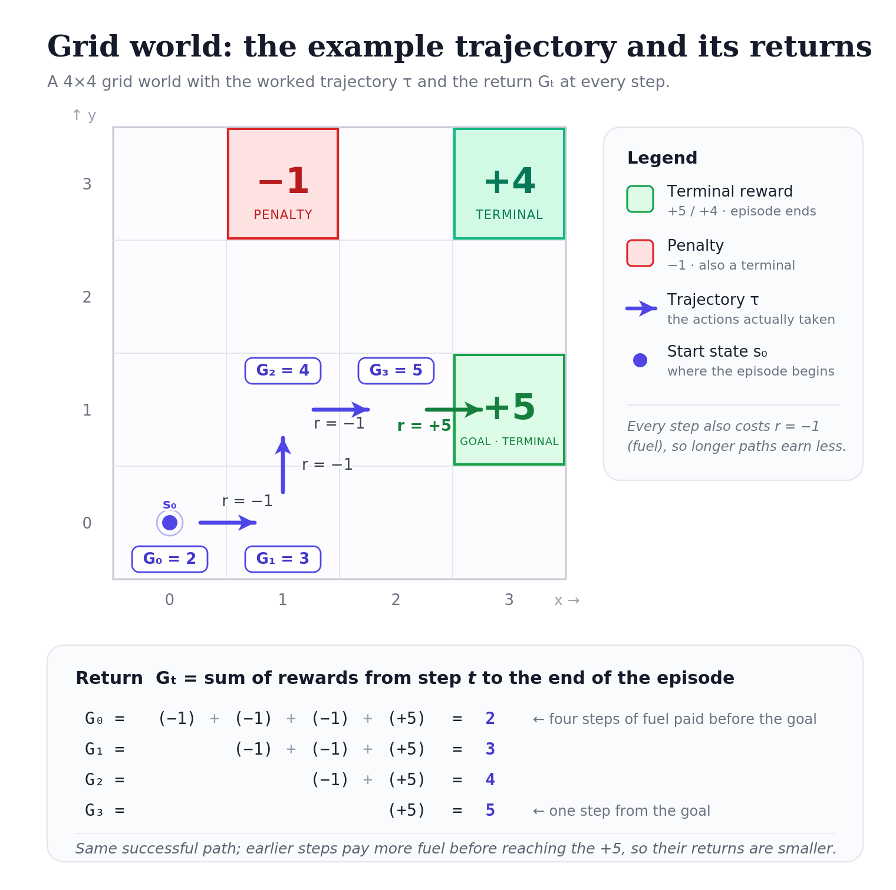



These notes walk through REINFORCE end-to-end. This first half builds the conceptual world the algorithm lives in: what RL is, what an MDP is, what value functions are, what trajectories are, where the objective $J(\theta)$ comes from, and what every piece of notation in it means. The [second half](/posts/series/how-llms-learn-to-reason/00-reinforce-gradient/index.qmd) derives the gradient that actually drives training. Both halves are needed: one tells you *what* you're maximizing, the other *how* gradient descent accomplishes it.

## 1. RL is a different kind of learning problem

In supervised learning, you have a dataset of inputs and labels, and you train a model to map one to the other. Reinforcement learning has no dataset. You have:

- an **environment** with states,
- an **agent** that takes actions and moves between states,
- a **reward signal** that tells the agent (after the fact) how well things are going.

The agent's job is to figure out a strategy, a **policy**, that collects as much reward as possible over time. Unlike supervised learning, the data is generated by the agent's own behavior, which means a bad policy generates bad data. This is what makes RL hard in a way classification never is.

Throughout these notes we'll use a small grid world. The agent occupies a square and can move up, down, left, or right. A few squares are terminal: $+5$ in one corner, $+4$ in another, and a "penalty" square that punishes with $-1$. Most squares are empty.

## 2. The Markov Decision Process

The grid world is an instance of a more general structure called a **Markov Decision Process** (MDP). An MDP has:

- a set of states $\mathcal{S}$,
- a set of actions $\mathcal{A}$,
- a reward function $R(s, a)$: how much reward you get for taking action $a$ in state $s$,
- transition dynamics $P(s' \mid s, a)$: what state you end up in next.

The basic transition mechanic is straightforward: at each timestep, the agent is in state $s$, picks action $a$, and the environment responds by giving reward $r$ and moving the agent to a new state $s'$. We write this as $s \xrightarrow{a} s'$.

Concretely in the grid world: if the agent is at $(2, 3)$ and chooses "right," then $s = (2, 3)$, $a = \rightarrow$, $s' = (3, 3)$, and $r = -1$ (assuming a per-step fuel cost; more on that below). The next iteration starts from $s' = (3, 3)$, which becomes the new "current state," and the cycle repeats until the agent hits a terminal square.

The next state $s'$ depends on which action $a$ was taken. From state $(2, 3)$:

- Action $\rightarrow$ leads to $s' = (3, 3)$
- Action $\uparrow$ leads to $s' = (2, 4)$
- Action $\leftarrow$ leads to $s' = (1, 3)$
- Action $\downarrow$ leads to $s' = (2, 2)$

In a deterministic environment like this grid world, $a$ uniquely determines $s'$. In a stochastic environment, taking action $a$ in state $s$ gives a *distribution* over possible next states. Think of a robot whose wheels sometimes slip. We'll come back to this distinction when we write the Bellman equation in its general form.

### Where rewards come from

The reward function $R(s, a)$ deserves a closer look, because it's the silent partner in the whole RL story.

The reward function is a **fixed property of the environment**, defined before training begins. It's not learned. It's not a parameter. The agent never modifies it. When the agent takes action $a$ from state $s$ and the environment returns reward $r_t$, the agent simply observes that number without seeing the rule that produced it.

In the grid world, you (the designer) wrote the rules: $+5$ at one terminal, $+4$ at another, $-1$ at the "penalty", $-1$ for every step taken. That table is the reward function. The agent will spend its entire training experiencing that table's outputs without ever being told the table exists.

This means **defining the reward function is how you specify the task**. Change the reward function, and you change the problem:

- Reward $+5$ at one corner → agent walks to that corner.
- Reward $+1$ for staying alive each step → agent learns to survive.
- Reward $-1$ everywhere → agent learns to terminate as fast as possible, possibly by walking into the "penalty".

The environment, states, and actions are the same; only the reward function differs, and that changes the behavior completely. This is why reward design is famously tricky: a poorly-specified reward gives you an agent that solves the wrong problem. (The classic example is a boat-racing agent that learned to drive in circles hitting respawning power-ups instead of finishing the race, because that gave more points.)

## 3. Trajectories and returns

The agent acting in the environment generates a **trajectory**: the full sequence of states, actions, and rewards from the start of an episode to the end:

$$\tau = (s_0, a_0, r_0,\; s_1, a_1, r_1,\; s_2, a_2, r_2,\; \ldots,\; s_T).$$

The Greek letter $\tau$ ("tau") is the standard symbol for it. A trajectory is also sometimes called an "episode" or a "rollout." All three terms mean the same thing: one run of the agent through the environment, from start to finish.

### The return $G_t$

The **return** from time $t$ onward is the sum of future rewards:

$$G_t = r_t + r_{t+1} + r_{t+2} + \cdots + r_T.$$

This $G_t$ is the most important quantity in REINFORCE. Three things to internalize about it.

**$G_t$ is forward-looking.** It only counts what happens *from $t$ onward*. Rewards collected before timestep $t$ don't enter into it. Each timestep in a trajectory has its own $G_t$, and earlier timesteps generally have more future ahead of them.

**$G_t$ is empirical, not predicted.** It's a number you measure after running an episode, by summing the rewards you actually got. It's not a parameter, not an output of any model. Just an observation.

**$G_t$ is different from $r_t$, and the distinction matters.** $r_t$ is the *single-step* reward at timestep $t$: what the agent got right then. $G_t$ is the *cumulative* return from $t$ onward: the sum of all rewards from that point to the end of the episode.

To make this concrete, here's a trajectory in the grid world:

$$\tau = \big((0,0), \rightarrow, -1,\; (1,0), \uparrow, -1,\; (1,1), \rightarrow, -1,\; (2,1), \rightarrow, +5\big).$$

The rewards are $r_0 = -1, r_1 = -1, r_2 = -1, r_3 = +5$. The returns at each timestep:

- $G_0 = -1 + (-1) + (-1) + 5 = 2$
- $G_1 = -1 + (-1) + 5 = 3$
- $G_2 = -1 + 5 = 4$
- $G_3 = 5$

Notice: $r_0 = -1$ but $G_0 = 2$. They're not the same number, and they measure different things.

Earlier timesteps had to pay more fuel costs before reaching the $+5$, so their returns are smaller. From $(2,1)$ at the end, the agent is one step from the reward, whereas from $(0,0)$ at the start it had to walk all the way there.

{#fig-grid-world fig-alt="A 4 by 4 grid world. The agent starts at the bottom-left cell and moves right, then up, then right, then right into a green plus-five goal cell, which is terminal. A red minus-one penalty cell and a green plus-four terminal cell sit in the top row, off the path. Each of the first three moves earns a reward of minus one (a fuel cost); the final move into the goal earns plus five. The return shown at each visited cell is 2, 3, 4, then 5: returns are larger for steps closer to the goal, because earlier steps pay more fuel before reaching the plus-five."}

### Why $G_t$ and not $r_t$ is what matters

Anticipating where REINFORCE is going: the gradient updates will weight each action by a return, not by an immediate reward. The reason is that the immediate reward $r_t$ doesn't tell you whether the action you took was *good* in any meaningful sense. In the grid world, every step has reward $-1$ regardless of which direction you moved. The single-step reward gives you no information about whether you moved *toward* the $+5$ or *away* from it.

What does carry that information? The total reward you collected after taking the action. If $a_t$ ultimately got you to the $+5$, it was probably part of a good plan; if it ended up at the "penalty", it was probably a bad choice.

$G_t$ captures this. It's the agent's verdict on "how did things go after I took action $a_t$?", which is exactly the right signal for deciding whether to make $a_t$ more or less likely in the future. We'll come back to this when we form the objective.

### The credit assignment problem

There's a deeper problem hiding behind this design choice, and it has a name worth knowing.

Suppose the agent finally gets a $+5$ reward at step 20. *Which of the 20 actions deserves credit?* The action right before the reward? The one 15 steps earlier that put the agent on the right path? All of them? Some combination?

This is called the **credit assignment problem**, and it's the central difficulty of reinforcement learning. In supervised learning, every input has its own label, so credit is unambiguous: image $x_i$ goes with label $y_i$. In RL, rewards are often sparse and delayed: you take many actions before learning whether any of them were good, and there's no per-step label telling you which actions worked.

$G_t$'s answer is brutally simple: assign every action the credit of *everything that came after it*. The action at step 15 gets credit for the $+5$ reward at step 20, because that reward is part of $G_{15}$. So does the action at step 1, because $G_1$ also includes that reward. This is unfair on a per-action basis because some of those early actions probably didn't matter, but it averages out across many trajectories. Actions that *consistently* precede good outcomes will accumulate positive updates over many rollouts; actions that don't, won't. The noise washes out while the signal accumulates.

This is why REINFORCE needs lots of samples to work. Each individual trajectory gives you a noisy, unfair credit assignment. Only across many trajectories does the right policy emerge.

## 4. Values and the Bellman equation

Before talking about how to *learn* a policy, it helps to ask what makes a state "good." A natural answer: a state is good if you can collect a lot of reward starting from it. Define the **value** of a state $s$ as the return you'd expect if you played optimally from there.

In the simplest version of the grid world, where only terminal squares give reward, every non-terminal state satisfies:

$$V(s) = \max_a V(s'_a),$$

where $s'_a$ is the state reached by taking action $a$ from $s$. The value of a state is the best value among its neighbors. Notice the action-dependence: $s'$ depends on which $a$ you take. Writing it as $s'_a$ (or sometimes $s'(s, a)$) makes that explicit and avoids the slightly sloppy $\max_a V(s')$ notation that hides the dependence.

This is the **Bellman equation** in its simplest form, and it lets you propagate values from the terminal squares throughout the grid.

There's a wrinkle: with this rule alone, the agent has no incentive to hurry. Wandering forever before reaching the $+5$ is as good as walking straight there. To fix this, add a small per-step reward $r = -1$; a "fuel cost":

$$V(s) = \max_a \big[r + V(s'_a)\big].$$

Now the agent prefers shorter paths.

A second refinement is the **discount factor** $\gamma \in (0, 1]$, which says future rewards matter less than present ones: the same reason a dollar today is worth more than a dollar next year. With both:

$$V(s) = \max_a \big[r + \gamma V(s'_a)\big].$$

You might wonder why we need $\gamma$ when we already have the step cost $r$. They look redundant: both make the agent prefer short paths in the grid world. But they're solving different problems:

- The **step cost** makes long paths *expensive in absolute terms*. Every step subtracts 1 from the total return. A 3-step path to $+5$ nets $5 - 3 = 2$; a 10-step path nets $5 - 10 = -5$.
- The **discount factor** makes future rewards *worth less than present ones*. A reward of $5$ received in 3 steps is worth $\gamma^3 \cdot 5$ today; received in 10 steps, it's worth $\gamma^{10} \cdot 5$.

The practical reasons $\gamma$ does work the step cost can't:

1. **$\gamma$ encodes uncertainty about the future.** A reward you might get in 100 steps is less trustworthy than one you'll get in 2 steps. The world might change, the model might be wrong. $\gamma$ captures this: distant predictions get less weight because they're less reliable. A step cost just charges you for moving; it doesn't model uncertainty.

2. **$\gamma$ doesn't require knowing the right magnitude.** A step cost only works if you tune it. Set $r = -0.01$ in a grid where rewards are $\pm 5$ and the agent barely cares about path length; set $r = -10$ and the agent refuses to move. $\gamma$ is scale-free in this sense: $\gamma = 0.99$ creates a roughly-100-step planning horizon regardless of reward scale.

3. **They compose differently with positive rewards along the way.** In a "stay alive" task where each surviving step gives $+1$, a *negative* step cost would subtract from a signal that's supposed to be additive. $\gamma$ still works there: it just makes the agent prefer reward sooner rather than later.

So: the step cost is a reward-design choice (you, specifying the task, decide moving is bad), while $\gamma$ is a property of the agent's planning horizon (the agent decides distant futures matter less). They live at different levels.

Once $\gamma$ is in the picture, the return is also typically written with discounting:

$$G_t = r_t + \gamma r_{t+1} + \gamma^2 r_{t+2} + \cdots = \sum_{k=0}^{\infty} \gamma^k r_{t+k}.$$

This is the version that shows up in most modern RL writing. The undiscounted form earlier was a special case with $\gamma = 1$.

## 5. The general Bellman equation and expectations

In a stochastic environment, taking action $a$ in state $s$ doesn't deterministically land you in $s'$: it gives a *distribution* over next states. The fully general Bellman optimality equation handles this with an expectation:

$$V(s) = \max_a \mathbb{E}\big[r + \gamma V(s') \,\big|\, s, a\big],$$

or written out as a sum:

$$V(s) = \max_a \sum_{s'} P(s' \mid s, a)\big[R(s, a, s') + \gamma V(s')\big].$$

The two forms are the same equation. Going from the first to the second is just unpacking the expectation, so it's worth being clear about what an expectation is.

The expected value of a random variable $X$ is the weighted average of its possible values, where the weights are the probabilities:

$$\mathbb{E}[X] = \sum_x P(X = x) \cdot x.$$

That's it. Roll a fair six-sided die: outcomes $1, 2, 3, 4, 5, 6$ each with probability $\frac{1}{6}$, and $\mathbb{E}[X] = 3.5$. List every possible outcome, multiply by how likely it is, add up.

A **conditional** expectation $\mathbb{E}[X \mid Y = y]$ is the same weighted average, but using the conditional probabilities $P(X = x \mid Y = y)$ instead: "given that I know $Y = y$, what's the expected value of $X$?"

Apply this to the Bellman expectation: the random thing is $s'$ (taking action $a$ in state $s$ gives a random next state), and the quantity being averaged is $r + \gamma V(s')$. List all possible next states $s'$, weight each by $P(s' \mid s, a)$, and sum:

$$\mathbb{E}\big[r + \gamma V(s') \,\big|\, s, a\big] = \sum_{s'} P(s' \mid s, a)\big[R(s, a, s') + \gamma V(s')\big].$$

Concrete example. Suppose the agent is in state $s$, takes action $a = \rightarrow$, but the environment is noisy:

- 80% chance you actually go right, landing in $s'_1$ with reward $-1$
- 20% chance you slip up, landing in $s'_2$ with reward $-1$

Then the expected value inside the Bellman equation is

$$0.8 \cdot \big[-1 + \gamma V(s'_1)\big] + 0.2 \cdot \big[-1 + \gamma V(s'_2)\big].$$

Each possible outcome contributes its value, weighted by how likely it is.

In the deterministic case, $P(s' \mid s, a) = 1$ for one specific $s'$ and $0$ for everything else. The sum collapses to a single term $r + \gamma V(s')$, and the expectation disappears. That's why the simpler form $V(s) = \max_a [r + \gamma V(s'_a)]$ is fine for the grid world.

## 6. $V$ vs $Q$: two flavors of value

So far we've only talked about $V$, the value of a *state*. There's a closely related object $Q$, the value of a *state-action pair*. Both come up constantly in RL, and they answer slightly different questions.

**$V(s)$: the value of a state.** Answers: "How good is it to be in state $s$?" Specifically, the expected return starting from $s$ and following the policy from there:

$$V(s) = \mathbb{E}\big[G_t \,\big|\, s_t = s\big].$$

One number per state.

**$Q(s, a)$: the value of a state-action pair.** Answers: "How good is it to take action $a$ from state $s$?" The expected return if you take $a$ in state $s$ and *then* follow the policy:

$$Q(s, a) = \mathbb{E}\big[G_t \,\big|\, s_t = s, a_t = a\big].$$

One number per state-action pair. With 4 actions, $Q((2, 3), \cdot)$ is four numbers, one for each action you might take from $(2, 3)$.

The two are related. $V$ is what you get when you average $Q$ over the actions the policy would take:

$$V(s) = \sum_a \pi(a \mid s) \, Q(s, a).$$

If the policy is greedy (always picks the best action), this collapses to $V(s) = \max_a Q(s, a)$. So $V$ is the summary and $Q$ is the breakdown.

Why does this matter? Because $Q$ is more useful for *acting*. Suppose you have a value function and you need to choose an action.

- **With $V$:** you'd need to look ahead one step for each candidate action, see what state you'd land in, and check the value there. This requires knowing the environment dynamics.
- **With $Q$:** you read off the values directly and pick the action with the highest one. No model of the environment needed.

This is why deep RL methods that learn value functions almost always learn $Q$, not $V$. **DQN** (Deep Q-Network, the famous 2013 Atari paper) learns $Q$ directly: the network takes a state and outputs one number per action; you act greedily by picking the argmax. You don't need to know how the Atari game works internally; the $Q$-values tell you which button to press.

## 7. Why neural networks?

Iterating Bellman across a 16-square grid is fine, but iterating across the state space of Go, which has more positions than there are atoms in the universe, is not. You can't store one number per state, let alone visit each state repeatedly to update it.

The fix is to use a neural network as a **function approximator** in place of a giant lookup table. The network takes a state as input and outputs either:

- a **value estimate** ($V$ or $Q$): "from this state, you can expect roughly this much return," or
- a **policy**: "from this state, here are the probabilities of each action."

These two choices give the two main families of deep RL.

A **value network** approximates $V$ or $Q$. It's trained by enforcing the Bellman equation: the network's prediction at $s$ should match $r + \gamma$ times its prediction at the next state $s'$. Once trained, you act greedily: pick the action with the highest predicted value. DQN is the canonical example.

A **policy network** approximates the policy directly. It takes a state and outputs probabilities over actions. There's no Bellman equation, no value estimation. You train the network so good actions become more likely and bad actions become less likely. This is the world REINFORCE lives in.

Why use one over the other? Policy networks have several advantages worth knowing:

- They naturally output **stochastic policies** (next section), which matters for exploration.
- They handle **continuous action spaces** gracefully: a value network would need to argmax over an infinite set.
- They're often easier to train end-to-end with backpropagation, which is the whole point of writing $J(\theta)$ as something you can take a gradient of.

Value networks tend to be more sample-efficient when they work, but harder to stabilize. The two approaches aren't mutually exclusive: [actor-critic](/posts/series/how-llms-learn-to-reason/01-ppo/#ppo-value-network-critic) methods use both.

## 8. Stochastic policies and explore/exploit

A **deterministic** policy outputs the single best action: "from $(2, 3)$, always go right." A **stochastic** policy outputs a distribution: "from $(2, 3)$, go right with probability $0.8$, up with $0.1$, down with $0.05$, left with $0.05$."

Why prefer the stochastic version? Imagine the agent has found the $+4$ reward and learned to walk to it. With a deterministic policy, it will never deviate and will never discover the $+5$ reward sitting in another corner. Randomness is what lets the agent **explore**. A stochastic policy mostly **exploits** what it knows but occasionally tries something else, which is how it keeps improving.

This is also why the policy network outputs a **softmax** over actions rather than a single chosen action. The softmax gives a differentiable, naturally-stochastic parameterization; exactly what the gradient mechanics in Part II need.

## 9. The policy notation $\pi_\theta$

We've referenced "the policy" repeatedly. It's now time to give it a proper symbol.

**$\pi_\theta$** is the **policy**: the neural network that, given a state, outputs a probability distribution over actions. The Greek letter $\pi$ is the standard symbol for a policy. The subscript $\theta$ reminds you that the policy is parameterized by the network's weights $\theta$. Different weights produce different policies.

Three notations all show up in practice and mean closely related things:

- **$\pi_\theta$** on its own refers to the whole policy as an object: the full mapping from states to action distributions.
- **$\pi_\theta(\cdot \mid s)$** is the distribution over actions when the agent is in state $s$: for a 4-action grid world, that's 4 numbers summing to 1.
- **$\pi_\theta(a \mid s)$** is a single number: "the probability that policy $\pi$ (with weights $\theta$) assigns to action $a$ when in state $s$."

Concretely, for the grid world: the network takes a state like $(2, 3)$ as input, runs it through some layers, ends with a softmax, and outputs $\pi_\theta(\rightarrow \mid (2, 3)) = 0.4$, $\pi_\theta(\uparrow \mid (2, 3)) = 0.3$, $\pi_\theta(\leftarrow \mid (2, 3)) = 0.2$, $\pi_\theta(\downarrow \mid (2, 3)) = 0.1$. Four probabilities summing to 1. Sample one of them to get the action the agent actually takes.

### What the policy actually controls

It's worth being precise about what the policy $\pi_\theta$ is for. The policy controls exactly one thing: **the probability of choosing each action in each state**. That's it. Given a state, it produces a distribution. The agent samples from that distribution.

What the policy does *not* control:

- **The reward.** The environment decides what reward to give. The policy can't change this.
- **The next state.** The transition dynamics $P(s' \mid s, a)$ are a property of the environment. If the agent walks right and the floor is icy, the agent slides.
- **Which states are reachable.** The structure of the world is given. The policy only influences which reachable states the agent *tends to visit*.

The causal chain looks like this:

$$\theta \;\longrightarrow\; \pi_\theta(\cdot \mid s) \;\longrightarrow\; \text{action sampled} \;\longrightarrow\; \text{environment responds} \;\longrightarrow\; \text{reward + next state}.$$

The policy controls the second arrow. Everything downstream is the environment doing its thing. But by setting up that arrow well, i.e. assigning high probability to good actions in each state, the policy biases what happens in the rest of the chain toward outcomes we want.

This is also why the gradient mechanics in Part II are expressed in terms of $\nabla_\theta \log \pi_\theta(a \mid s)$. The only thing the agent can adjust is action probabilities. The only thing the gradient can affect is which actions get sampled.

A useful contrast: a **value function** ($V$ or $Q$) tells you *how good* states are rather than what to do, while a **policy** tells you *what to do* rather than predicting return. REINFORCE trains the policy directly, without ever learning a value function: the trajectories themselves provide the feedback signal.

## 10. The objective from a single trajectory

We can finally write down what REINFORCE is trying to do.

Run the agent. It produces a trajectory $\tau$. For each timestep $t$ in that trajectory, you can compute two things:

- $G_t$: the return that followed (you get this by summing rewards from $t$ onward).
- $\pi_\theta(a_t \mid s_t)$: the probability the policy assigned to the action that was actually taken.

The objective to maximize is:

$$J(\theta) = \sum_t G_t \log \pi_\theta(a_t \mid s_t)$$

Notice the structure: each term in the sum has two factors: the return $G_t$, and the log-probability of the action that produced it.

### How to read this sum

So if a trajectory has 4 steps ($t = 0, 1, 2, 3$), the sum is:

$$G_0 \log \pi_\theta(a_0 \mid s_0) + G_1 \log \pi_\theta(a_1 \mid s_1) + G_2 \log \pi_\theta(a_2 \mid s_2) + G_3 \log \pi_\theta(a_3 \mid s_3).$$

One term per timestep. Each term has two factors: the return $G_t$ from that timestep onward, and the log-probability of the action that was taken at that timestep.

Let's compute it for the grid-world trajectory we used earlier. The returns were $G_0 = 2, G_1 = 3, G_2 = 4, G_3 = 5$. Suppose the current policy assigned these probabilities to the actions actually taken:

- $\pi_\theta(\rightarrow \mid (0,0)) = 0.4$, so $\log \pi_\theta = \log(0.4) \approx -0.92$
- $\pi_\theta(\uparrow \mid (1,0)) = 0.3$, so $\log \pi_\theta \approx -1.20$
- $\pi_\theta(\rightarrow \mid (1,1)) = 0.5$, so $\log \pi_\theta \approx -0.69$
- $\pi_\theta(\rightarrow \mid (2,1)) = 0.7$, so $\log \pi_\theta \approx -0.36$

Plug in:

$$\sum_t G_t \log \pi_\theta(a_t \mid s_t) = 2(-0.92) + 3(-1.20) + 4(-0.69) + 5(-0.36).$$

$$= -1.84 - 3.60 - 2.76 - 1.80 = -10.0.$$

That's one number: the value of $J(\theta)$ for this specific trajectory under the current policy.

### What does that number mean?

On its own, the absolute value isn't very meaningful. What matters is how the sum *changes* as $\theta$ changes.

Each term $G_t \log \pi_\theta(a_t \mid s_t)$ is doing something specific:

- **If $G_t$ is large and positive** (the trajectory after this timestep was good), then $G_t \log \pi_\theta(a_t \mid s_t)$ is a large negative number that gets *less negative* if $\pi_\theta(a_t \mid s_t)$ increases. So the sum increases when the policy raises the probability of $a_t$.

- **If $G_t$ is negative** (things went badly after this timestep), then $G_t \log \pi_\theta(a_t \mid s_t)$ is positive, and it *increases* when $\pi_\theta(a_t \mid s_t)$ decreases. So the sum increases when the policy lowers the probability of $a_t$.

Putting those together: the sum is large when the policy assigns high probability to actions that led to good returns *and* low probability to actions that led to bad returns. Maximizing it pushes the policy in exactly the direction we want.

This is also why $G_t$ is the right multiplier here, not $r_t$. The return $G_t$ is the agent's verdict on whether action $a_t$ was a good choice, accounting for everything that followed. The single-step reward $r_t$ would tell us nothing useful in environments where rewards are delayed.

## 11. The objective as an expectation

The single-trajectory form is what you actually compute in code. But to be precise about what $J(\theta)$ really *is*, you need to think of it as an expectation.

Each time you run the agent, you get a different trajectory, because the policy is stochastic and the environment may be too. The "true" objective averages over all the trajectories the policy could possibly produce:

$$J(\theta) = \mathbb{E}_{\tau \sim \pi_\theta}\bigg[\sum_t G_t \log \pi_\theta(a_t \mid s_t)\bigg].$$

Reading the new piece of notation:

- **$\tau \sim \pi_\theta$** reads as "trajectory $\tau$ sampled from $\pi_\theta$": meaning $\tau$ is generated by running the policy $\pi_\theta$ in the environment.
- **$\mathbb{E}_{\tau \sim \pi_\theta}[\cdot]$** reads as "the expectation, where the randomness comes from sampling trajectories from the policy."

So in plain English: "run the policy infinitely many times, compute the bracketed sum on each trajectory, and average the results."

### Expanding the expectation

The expectation is shorthand for a weighted average over trajectories. Let's expand it.

**Step 1: What's the probability of a specific trajectory $\tau$?**

A trajectory is a sequence:

$$\tau = (s_0, a_0, r_0,\; s_1, a_1, r_1,\; \ldots,\; s_T).$$

For this exact sequence to occur, every step has to play out a particular way. The probability is the product of all the individual things that had to happen:

$$P(\tau \mid \theta) = \rho_0(s_0) \cdot \prod_{t=0}^{T-1} \pi_\theta(a_t \mid s_t) \cdot P(s_{t+1} \mid s_t, a_t).$$

Reading the pieces:

- $\rho_0(s_0)$: the probability that the episode started at $s_0$. (Some problems have a fixed start state; others sample from a distribution. $\rho_0$ covers both.)
- $\pi_\theta(a_t \mid s_t)$: the probability that the policy chose action $a_t$ in state $s_t$. (This is the only piece that depends on $\theta$.)
- $P(s_{t+1} \mid s_t, a_t)$: the probability that the environment transitioned to $s_{t+1}$ given the state and action. (This is the environment dynamics: fixed, not learnable.)

In a deterministic environment with a fixed start state, $\rho_0$ and $P$ are all 0 or 1, so the trajectory probability simplifies to just $\prod_t \pi_\theta(a_t \mid s_t)$: the product of the policy probabilities along the path.

**Step 2: Plug into the expectation.**

The expectation sums over all possible trajectories, weighted by their probabilities:

$$J(\theta) = \sum_{\tau} P(\tau \mid \theta) \cdot \bigg[\sum_t G_t \log \pi_\theta(a_t \mid s_t)\bigg].$$

Substituting the expression for $P(\tau \mid \theta)$:

$$J(\theta) = \sum_{\tau} \bigg[\underbrace{\rho_0(s_0) \prod_{t=0}^{T-1} \pi_\theta(a_t \mid s_t) P(s_{t+1} \mid s_t, a_t)}_{\text{probability of this trajectory}}\bigg] \cdot \bigg[\underbrace{\sum_t G_t \log \pi_\theta(a_t \mid s_t)}_{\text{value of this trajectory}}\bigg].$$

That's the fully expanded form.

The "$\sum_\tau$" is summing over *every possible trajectory*: every possible starting state, every possible sequence of actions the policy might take, every possible sequence of next states the environment might produce.

### Why nobody computes this directly

In the grid world with 16 squares, 4 actions, and episodes of length up to 20 steps, the number of possible trajectories is roughly $4^{20}$ even before accounting for state randomness. In something like Atari or Go, it's effectively infinite.

You can't enumerate all trajectories. You can't compute $P(\tau \mid \theta)$ for each one. You especially can't, because $P(s_{t+1} \mid s_t, a_t)$ is the environment dynamics. You usually don't even know it; you just experience it by stepping the simulator.

This is exactly why we sample. Instead of summing over all trajectories with their true probabilities, we:

1. Run the policy once. The environment naturally generates a trajectory with the right probability. We don't need to know $P$ explicitly because the simulator embodies it.
2. Compute $\sum_t G_t \log \pi_\theta(a_t \mid s_t)$ for that trajectory.
3. Treat this as a single sample from the expectation.
4. Average across many such samples (across many gradient steps).

This is called a **Monte Carlo estimate**: using random samples to approximate an expectation.

## 12. Putting the training loop together

We now have all the pieces. The REINFORCE training loop:

1. **Roll out a trajectory.** Starting from some initial state, sample actions from the current policy $\pi_\theta$ until the episode ends. Record states, actions, and rewards along the way.

2. **Compute the returns.** For each timestep $t$ in the trajectory, sum the (discounted) rewards from $t$ onward to get $G_t$.

3. **Form the objective.** Plug into $J(\theta) = \sum_t G_t \log \pi_\theta(a_t \mid s_t)$. This is your single-sample estimate of the true expected objective.

4. **Update the parameters.** Take a gradient step on $L(\theta) = -J(\theta)$.

5. **Repeat.** With updated parameters, roll out a new trajectory and do it again.

A useful intuition: the policy network is being shown its own past behavior and told *do more of what worked, less of what didn't*. The return $G_t$ is the supervision signal: it plays the role that the label plays in supervised learning, except the agent generates it for itself by interacting with the environment.

### The training loop in code

To make this concrete, here's the entire REINFORCE training loop in PyTorch. The grid world is abstracted as `env`, and the policy is a small neural network.

```python
import torch
import torch.nn.functional as F

# Hyperparameters
learning_rate = 1e-3
gamma = 0.99
num_episodes = 10000

# Policy network: state -> action logits
policy = PolicyNetwork()  # outputs logits over actions
optimizer = torch.optim.Adam(policy.parameters(), lr=learning_rate)

for episode in range(num_episodes):
    # 1. Roll out a trajectory
    states, actions, rewards = [], [], []
    state = env.reset()
    done = False
    while not done:
        logits = policy(state)                     # action logits for this state
        probs = F.softmax(logits, dim=-1)          # action probabilities
        action = torch.multinomial(probs, 1).item()  # sample an action
        next_state, reward, done = env.step(action)

        states.append(state)
        actions.append(action)
        rewards.append(reward)
        state = next_state

    # 2. Compute returns G_t for each timestep (working backward)
    returns = []
    G = 0
    for r in reversed(rewards):
        G = r + gamma * G
        returns.insert(0, G)
    returns = torch.tensor(returns)

    # 3. Form the loss
    # For each timestep, we want G_t * log pi(a_t | s_t).
    # We sum over t and negate (since optimizers minimize).
    loss = 0
    for s_t, a_t, G_t in zip(states, actions, returns):
        logits = policy(s_t)
        log_probs = F.log_softmax(logits, dim=-1)
        loss = loss - G_t * log_probs[a_t]

    # 4. Update parameters
    optimizer.zero_grad()
    loss.backward()
    optimizer.step()
```

A few things worth flagging in this code:

**The negation.** Because optimizers minimize by default, we minimize $-J(\theta)$, which is equivalent to maximizing $J(\theta)$. Hence `loss = loss - G_t * log_probs[a_t]` instead of `+`.

**Returns computed backward.** The `for r in reversed(rewards)` loop is the standard way to compute returns in $O(T)$ time using the recursion $G_t = r_t + \gamma G_{t+1}$. Forward computation would be $O(T^2)$.

**One trajectory per gradient step.** This is REINFORCE in its purest form. In practice you'd batch multiple trajectories before each step to reduce variance, but the algorithm doesn't require it.

## 13. The bridge to the gradient mechanics

This is the conceptual frame in which REINFORCE makes sense. We have an objective $J(\theta)$, written either as a single-trajectory sum or as an expectation over trajectories, and we want to maximize it. Equivalently, we minimize $L(\theta) = -J(\theta)$ by gradient descent.

What this frame *doesn't* tell you is *why* gradient descent on $L$ actually causes good actions to become more probable. That question lives one layer down. It's about how the gradient flows through the softmax to the logits, and from the logits back through the network to the parameters. That's what [Part II](/posts/series/how-llms-learn-to-reason/00-reinforce-gradient/index.qmd) is about.

