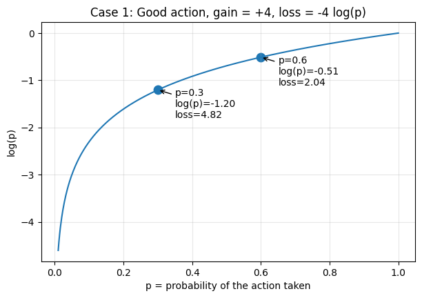
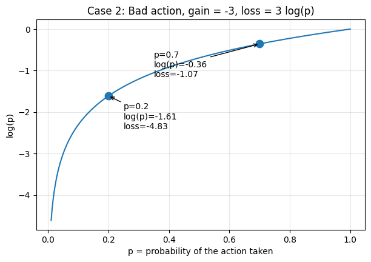



[Part 1](/posts/series/how-llms-learn-to-reason/00-reinforce-foundations/index.qmd) built the world REINFORCE lives in and arrived at the objective: $J(\theta) = \sum_t G_t \log \pi_\theta(a_t \mid s_t)$, the thing we want to maximize. What it did not explain is *why* gradient descent on that objective actually makes good actions more likely. That question lives one layer down, in how the gradient flows through the softmax to the logits and back to the parameters. This part derives that mechanism.

## 1. The objective and its loss form

Restating, with the notation now grounded:

$$J(\theta) = \sum_t G_t \log \pi_\theta(a_t \mid s_t).$$

- $J(\theta)$ is the objective we want to maximize.
- $\theta$ is the network's parameters.
- $\pi_\theta(a_t \mid s_t)$ is the probability the policy assigns to action $a_t$ in state $s_t$.
- $G_t$ is the return from time $t$: positive when the trajectory was good, negative when bad.

Neural networks are typically trained by *minimizing* a loss, so define

$$L(\theta) = -J(\theta) = -\sum_t G_t \log \pi_\theta(a_t \mid s_t).$$

Minimizing $L$ is equivalent to maximizing $J$. The sign flip is purely a notational convenience for using minimize-by-default optimizers.

## 2. Why the loss form does the right thing

Look at one term in isolation: $L = -G \log p$, where $p = \pi_\theta(a_t \mid s_t)$.

**Good action ($G > 0$).** If $p$ increases, $\log p$ increases (becomes less negative), so $-G \log p$ decreases. Minimizing $L$ encourages $p$ to grow.

{#fig-case1 fig-alt="Good action case."}

**Bad action ($G < 0$).** Then $-G$ is positive, so $L = -G \log p = (\text{positive}) \cdot \log p$. If $p$ decreases, $\log p$ becomes more negative, so $L$ decreases. Minimizing $L$ encourages $p$ to shrink.

{#fig-case2 fig-alt="Bad action case."}

So the form of $L$ encodes the right thing: minimizing it pushes good-action probabilities up and bad-action probabilities down. This is the easy part of the argument. It tells us that *if* probabilities move appropriately, the loss decreases. The harder question is whether gradient descent on $L$ actually causes them to move that way. For that, we need to look one layer deeper.

## 3. A useful reframe: REINFORCE is supervised learning with two tweaks

Before diving into the gradient mechanics, here's a mental model that makes the REINFORCE loss feel less arbitrary and connects it to something you already know.

In standard supervised classification, the cross-entropy loss is

$$L_{\text{sup}} = -\sum_i \log p(y_i \mid x_i),$$

where $y_i$ is the true label for input $x_i$. Minimizing this pushes the network's predicted probability of the correct class upward.

Now compare to REINFORCE:

$$L_{\text{REINFORCE}} = -\sum_t G_t \log \pi_\theta(a_t \mid s_t).$$

These are the *same form*, with two changes:

1. **Replace the label with the sampled action.** We don't know what action *should* have been taken. There's no oracle telling us "the correct move from $(2, 3)$ was $\rightarrow$." So we use the action the policy actually sampled as a kind of pseudo-label.
2. **Multiply each term by $G_t$.** Supervised learning treats every example as equally important. Every label is "correct" by definition. REINFORCE doesn't have that luxury, so it weights each pseudo-labeled example by how good the outcome turned out to be. Positive $G_t$ scales the term up (do *more* of this); negative $G_t$ flips its sign (do *less* of this).

Read this way, REINFORCE is just supervised learning where (a) the agent generates its own pseudo-labels by sampling, and (b) each example is weighted by how good the outcome turned out to be.

This means the gradient mechanics we're about to derive are *exactly* the gradient mechanics of supervised cross-entropy, scaled by $G_t$. If you've ever computed the gradient of cross-entropy through a softmax, you've already done most of the work. The next few sections are just making that work explicit and showing how the $G_t$ scaling rides along.

## 4. The network outputs logits, not probabilities

The neural network does not directly output probabilities. It outputs **logits**, which are then converted to probabilities via softmax. With two actions:

$$p(\rightarrow) = \frac{e^{z_\rightarrow}}{e^{z_\rightarrow} + e^{z_\leftarrow}}.$$

For example, with $z_\rightarrow = 1.0$ and $z_\leftarrow = 0.0$:

$$p(\rightarrow) = \frac{e^1}{e^1 + e^0} \approx 0.73, \qquad p(\leftarrow) \approx 0.27.$$

Logits determine probabilities, so changing the logits changes them. Gradient descent updates the logits (and ultimately the weights that produce them):

$$z_\rightarrow \leftarrow z_\rightarrow - \eta \frac{\partial L}{\partial z_\rightarrow}.$$

So the question becomes: what is $\partial L / \partial z_\rightarrow$, and does its sign push the logit in a direction that makes the action's probability move correctly?

## 5. The chain rule

Focus on one step: $L = -G \log p(\rightarrow)$. By the chain rule,

$$\frac{\partial L}{\partial z_\rightarrow} = -G \cdot \frac{\partial \log p(\rightarrow)}{\partial z_\rightarrow}.$$

We need $\partial \log p(\rightarrow) / \partial z_\rightarrow$.

## 6. Deriving the key softmax gradient

Starting from the softmax and using $\log(A/B) = \log A - \log B$:

$$\log p(\rightarrow) = \log\!\left(\frac{e^{z_\rightarrow}}{e^{z_\rightarrow} + e^{z_\leftarrow}}\right) = z_\rightarrow - \log\!\left(e^{z_\rightarrow} + e^{z_\leftarrow}\right).$$

Differentiate term by term. The first term gives $1$. For the second, let $u = e^{z_\rightarrow} + e^{z_\leftarrow}$. Then $\partial u / \partial z_\rightarrow = e^{z_\rightarrow}$ (the $e^{z_\leftarrow}$ piece doesn't depend on $z_\rightarrow$), so

$$\frac{\partial \log u}{\partial z_\rightarrow} = \frac{1}{u} \cdot e^{z_\rightarrow} = \frac{e^{z_\rightarrow}}{e^{z_\rightarrow} + e^{z_\leftarrow}} = p(\rightarrow).$$

Putting it together:

$$\frac{\partial \log p(\rightarrow)}{\partial z_\rightarrow} = 1 - p(\rightarrow).$$

This is a clean, elegant result: as the action becomes more confident ($p \to 1$), the gradient shrinks toward zero, with nothing left to push.

## 7. The gradient on the loss

Substituting back:

$$\frac{\partial L}{\partial z_\rightarrow} = -G\,(1 - p(\rightarrow)).$$

This is the core equation. With it, we can check that gradient descent does the right thing.

Use $p(\rightarrow) = 0.73$ and $1 - p = 0.27$.

**Good action ($G = +4$):**
$$\frac{\partial L}{\partial z_\rightarrow} = -4 \times 0.27 = -1.08 \quad\Rightarrow\quad z_\rightarrow \leftarrow z_\rightarrow + 1.08\,\eta.$$
$z_\rightarrow$ increases, which pushes $p(\rightarrow)$ up.

**Bad action ($G = -4$):**
$$\frac{\partial L}{\partial z_\rightarrow} = -(-4) \times 0.27 = +1.08 \quad\Rightarrow\quad z_\rightarrow \leftarrow z_\rightarrow - 1.08\,\eta.$$
$z_\rightarrow$ decreases, which pushes $p(\rightarrow)$ down.

## 8. Closing the loop

Increasing $z_\rightarrow$ enlarges the numerator of the softmax and pushes $p(\rightarrow)$ up; decreasing it pushes $p(\rightarrow)$ down. Combined with the gradient signs from the previous section:

- $G > 0 \;\Rightarrow\; \partial L / \partial z_\rightarrow < 0 \;\Rightarrow\; z_\rightarrow \uparrow \;\Rightarrow\; p(\rightarrow) \uparrow$
- $G < 0 \;\Rightarrow\; \partial L / \partial z_\rightarrow > 0 \;\Rightarrow\; z_\rightarrow \downarrow \;\Rightarrow\; p(\rightarrow) \downarrow$

## 9. The general update rule

Everything above was for a single timestep and a single logit. For the full sum across the trajectory, the same logic gives

$$\nabla_\theta L = -\sum_t G_t \nabla_\theta \log \pi_\theta(a_t \mid s_t),$$

and the gradient-descent step on $L$ becomes

$$\theta \leftarrow \theta - \eta \nabla_\theta L = \theta + \eta \sum_t G_t \nabla_\theta \log \pi_\theta(a_t \mid s_t).$$

This is the **REINFORCE update**:

$$\Delta \theta \propto G_t \, \nabla_\theta \log \pi_\theta(a_t \mid s_t).$$

Each parameter gets nudged in the direction $\nabla_\theta \log \pi_\theta(a_t \mid s_t)$, the direction that would increase the probability of the action that was actually taken, scaled by $G_t$, the return that followed. Good actions ($G_t > 0$) get reinforced; bad actions ($G_t < 0$) get suppressed.