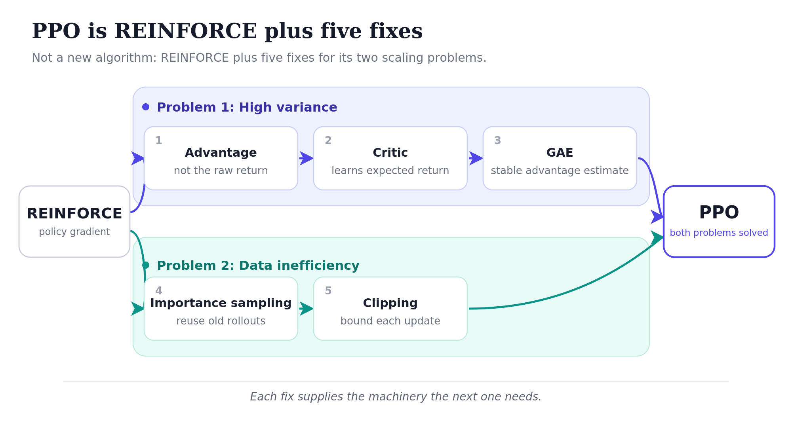



Most treatments of PPO either start with MDPs and Bellman equations and lose you in the abstract before the algorithm appears, or treat PPO as a black box. Neither helps when you actually want to understand it. Here's the framing that finally made it stick for me: PPO [@schulman_etal_2017] is REINFORCE with five fixes that, together, solve two problems.

The plan: walk through the two problems REINFORCE has, watch each PPO fix arise as a response to one of them, and end by tracing how the final objective decomposes all the way down to things you can actually compute.

## REINFORCE in one breath

Reinforcement learning is the framework where an agent takes actions in an environment, the environment responds with reward and a new state, and the agent's job is to find a strategy, a policy, that collects as much reward as possible. Unlike supervised learning, the agent generates its own training data by acting. Bad policies generate bad data. That's what makes RL hard in a way classification never is.

The simplest policy gradient algorithm is REINFORCE. Run the policy. Observe what happens. Update the policy so good actions become more likely and bad ones less likely. The objective being maximized:

$$J(\theta) = \sum_t G_t \log \pi_\theta(a_t \mid s_t).$$

Reading the parts: $\pi_\theta(a_t \mid s_t)$ is the probability the policy assigns to the action that was actually taken in state $s_t$. $G_t$ is the *return* from time $t$: the sum of future rewards from that point to the end of the trajectory.

### REINFORCE as supervised learning, with twists

Here's the framing that finally made REINFORCE click for me. Standard supervised cross-entropy classification minimizes:

$$L_{\text{sup}} = -\sum_i \log p(y_i \mid x_i),$$

where $y_i$ is the true label for $x_i$. Compare to REINFORCE:

$$L_{\text{REINFORCE}} = -\sum_t G_t \log \pi_\theta(a_t \mid s_t).$$

Same form, two changes:

1. **No labels: use the sampled action as a pseudo-label.** RL doesn't tell us what the "correct" action was. So we use the action the policy actually sampled as a stand-in. The training signal becomes "do more of what you just did." Which sounds insane, until you remember the second change.
2. **Weight each pseudo-labeled example by how the trajectory turned out.** Supervised learning treats every example as equally important. Every label is correct by definition. REINFORCE weights each term by $G_t$. Positive $G_t$ scales the term up: do more of this. Negative $G_t$ flips its sign: do less.

Read this way, REINFORCE is supervised learning where the agent generates its own pseudo-labels by sampling, and each pseudo-labeled example is weighted by how things turned out. That's the whole conceptual content of the algorithm. The gradient mechanics (softmax derivatives, autograd, the chain rule) are *exactly* the gradient mechanics of supervised cross-entropy, scaled by $G_t$. If you've ever trained a classifier, you've already done most of the work.

### The training loop

The loop is correspondingly small:

```python
for episode in range(num_episodes):
    # 1. Roll out a trajectory under the current policy
    states, actions, rewards = rollout(env, policy)

    # 2. Compute returns G_t for each timestep, working backward
    returns = []
    G = 0
    for r in reversed(rewards):
        G = r + gamma * G
        returns.insert(0, G)

    # 3. Form the loss and update
    loss = 0
    for s_t, a_t, G_t in zip(states, actions, returns):
        logits = policy(s_t)
        log_probs = F.log_softmax(logits, dim=-1)
        loss = loss - G_t * log_probs[a_t]

    optimizer.zero_grad()
    loss.backward()
    optimizer.step()
```

Three things to notice. Autograd does all the work. We never compute the policy gradient by hand. We construct a loss whose gradient *is* the policy gradient and let the framework handle it. The negation in `loss = loss - G_t * log_probs[a_t]` is because optimizers minimize by default, so we minimize $-J$, equivalent to maximizing $J$. Returns are computed backward through the trajectory in $O(T)$ using the recursion $G_t = r_t + \gamma G_{t+1}$.

### The two problems

REINFORCE works. People used it. Two problems become obvious the moment you scale it.

**Problem 1: high variance.** The "total reward that followed an action" varies wildly across rollouts even when the action itself was fine. Take the same action twice from the same state under a stochastic policy and you might see very different total rewards because what happened *afterward* was different. The training signal jumps around. Learning is slow and unstable.

**Problem 2: data inefficiency.** A trajectory is expensive to collect. For an LLM, sampling a 500-token response takes real GPU time. REINFORCE throws each one away after a single gradient update, because after that update the policy has changed and the old data is no longer "from the right distribution": a sense we'll make precise when we get to importance sampling.

PPO fixes both. The first three fixes attack variance. The last two attack data inefficiency. Each fix introduces machinery the next one needs, so they're easiest to read in order.

{#fig-ppo-five-fixes fig-alt="A diagram. A REINFORCE box on the left is labelled as having two problems. It branches into two lanes. The top lane, Problem 1 High variance, contains three fixes in order: use the advantage, add a critic, estimate it with GAE. The bottom lane, Problem 2 Data inefficiency, contains two fixes in order: importance sampling, then clip the ratio. Both lanes converge into a PPO box on the right marked both problems solved. Small notes on each fix show how it leads to the next: the advantage needs a value, the critic must be combined with rewards, importance sampling ratios can explode and so must be clipped."}

## PPO as five fixes

### Fix 1: Use the advantage, not the raw reward

The first variance-reduction trick is to stop asking "what reward followed this action?" and start asking "did this action do better than expected?"

A concrete anchor for the rest of the piece: imagine training a chatbot to answer the question "What is PPO?" The model generates a response token by token: "*PPO is a reinforcement learning algorithm...*". Then at the end a reward model scores the whole response. Each token is one action. Each full response is one trajectory.

When the model picks "reinforcement" partway through, was that a good choice? It depends on what was available at that point. If most plausible alternatives at that position would have led to a coherent response anyway, the choice isn't special. If most would have led somewhere worse, then "reinforcement" was a good pick we want to reinforce.

The "expected reward from this state" is the *value* of the state. The action's *advantage* is how much better than the value the actual outcome was:

```python
Advantage = (what happened) − (what we'd expect on average from this state)
```

Substituting advantage for raw reward in the policy gradient cuts variance dramatically. Actions that go as expected contribute roughly zero to the gradient. Only genuinely surprising actions, good or bad, drive updates. The noise from "all of these actions were fine, actually" stops contributing.

The catch: to compute advantage, you need the value of each state. We don't know it directly. So we *learn it*, with a second neural network.

### Fix 2: Add a value network (the critic) {#ppo-value-network-critic}

PPO trains two networks in parallel:

- The **policy network** (the actor) takes a state, outputs a distribution over actions. For LLMs, this *is* the language model.
- The **value network** (the critic) takes a state, outputs a single number: the expected total reward from this state onward.

For the chatbot, the value network looks at a partial response, e.g. *"PPO is a reinforcement learning"*, and outputs something like 0.6, meaning "responses that start this way tend to score around 0.6 from the reward model." After the next token, the partial response becomes *"PPO is a reinforcement learning algorithm"* and the value might shift to a slightly higher score of 0.65, indicating that the response is heading somewhere good. The critic is essentially a running estimate of "how well is this generation going so far?"

The critic doesn't act. It just judges. Taken together, the actor and critic give an *actor-critic* architecture, of which PPO is one specific instance.

How does the critic learn? Standard regression. After a rollout, you have actual rewards $r_0, r_1, \ldots, r_T$. From any state $s_t$ along the trajectory, the actual return is $G_t = r_t + \gamma r_{t+1} + \ldots + \gamma^{T-t} r_T$. Train the critic to predict $G_t$ from $s_t$ using mean-squared-error. Over many trajectories the critic becomes a calibrated estimator, and the advantages it underwrites become reliable.

For LLMs, the value network is typically a copy of the policy architecture: same transformer body, with a small linear head outputting a scalar instead of a token distribution. Whether the bodies are *shared* (parameters trained jointly) or *separate copies* (parameters trained independently) varies by implementation.

### Fix 3: Estimate the advantage with GAE

There's a subtle decision in *how* to compute the advantage from rollout data. Two extremes:

- **Use the actual rewards that followed.** Accurate but noisy: at the mercy of every random thing that happened in the trajectory.
- **Trust the value network's predictions.** Stable but biased: if the critic is wrong, your advantages are wrong.

You can blend. Use the actual rewards for the next few steps, then have the critic estimate the rest. This is the *n-step* family of advantage estimators, parameterized by how many real-reward steps to use before deferring to the critic. Small $n$ trusts the critic. Large $n$ trusts the rewards.

Rather than picking one $n$, **Generalized Advantage Estimation** [@schulman_etal_2016] takes an exponentially-weighted average across all $n$:

$$\hat{A}_t^{\text{GAE}} = (1-\lambda)\hat{A}_t^{(1)} + (1-\lambda)\lambda\hat{A}_t^{(2)} + (1-\lambda)\lambda^2\hat{A}_t^{(3)} + \ldots$$

The $(1-\lambda)$ prefactors normalize the weights to sum to 1 (geometric series). Small $\lambda$ puts most weight on the 1-step estimator (trust the critic); large $\lambda$ flattens the weights toward the full-trajectory estimator (trust the rewards). Default $\lambda = 0.95$.

The pleasing thing is that this weighted average collapses to a clean recursion. The intermediate identity that does the work is the *TD residual*:

$$\delta_t = r_t + \gamma V(s_{t+1}) - V(s_t).$$

"TD" stands for *Temporal Difference*: the residual compares two value predictions ($V(s_t)$ and $V(s_{t+1})$) separated by one time step, after accounting for the actual reward observed during that step. If the critic were perfect, $\delta_t$ would always be zero. When nonzero, $\delta_t$ measures how wrong the critic was, and in which direction. The same number has two names because it plays two roles: it's a *prediction error of the critic* (which is what trains the value network) and it's the *simplest possible advantage estimate* ($\delta_t = \hat{A}_t^{(1)}$, the first row of the n-step ladder).

Now the GAE collapse. Each n-step advantage can be written as a sum of TD residuals, $\hat{A}_t^{(n)} = \sum_{k=0}^{n-1} \gamma^k \delta_{t+k}$ (the unpacking chain at the end walks through this for the 2-step case). Substituting into the GAE weighted average and collecting by $\delta$, the geometric series collapses each coefficient: $\delta_{t+k}$ ends up with weight $(\gamma\lambda)^k$. So:

$$\hat{A}_t^{\text{GAE}} = \delta_t + \gamma\lambda \, \delta_{t+1} + (\gamma\lambda)^2 \, \delta_{t+2} + \ldots = \delta_t + \gamma\lambda \, \hat{A}_{t+1}^{\text{GAE}}.$$

That's the entire GAE computation: a backward pass through the trajectory accumulating $\gamma\lambda$-decayed TD residuals.

```python
advantages = []
gae = 0
for t in reversed(range(len(rewards))):
    delta = rewards[t] + gamma * values[t + 1] - values[t]
    gae = delta + gamma * lam * gae
    advantages.insert(0, gae)
```

That's it. GAE is one of the most important practical contributions in policy gradient methods. Almost every modern algorithm uses it. But you don't need to derive it to use it. Two knobs: $\gamma$ (discount factor, typically 0.99) and $\lambda$ (the GAE parameter, typically 0.95).

Fixes 1, 2, and 3 together complete the variance-reduction story. Fixes 4 and 5 attack the data-inefficiency problem.

### Fix 4: Importance sampling: reusing data

We collected an expensive trajectory. We'd like to do many gradient steps on it, not one. The wrinkle that's specific to RL: unlike supervised learning, where data sits in a fixed dataset, here you generate your training data by running the current policy. After one gradient step, the policy is different, and the trajectory we just used is now from the previous policy. Thus reusing this trajectory is, strictly speaking, off-policy.

Importance sampling is the statistical trick that corrects for this. Each old data point gets a weight equal to the ratio of "how likely is this action under the new policy" to "how likely was it under the old policy":

$$r_t(\theta) = \frac{\pi_\theta(a_t \mid s_t)}{\pi_{\theta_{\text{old}}}(a_t \mid s_t)}.$$

If the new policy still likes the action just as much, the ratio is 1, and the data point counts normally. If the new policy now likes the action more, the ratio is greater than 1; if less, less than 1. Multiplied with the advantage, $r_t(\theta) \cdot \hat{A}_t$ gives a corrected gradient signal that's valid even though the data wasn't generated by the current policy.

This is what lets you take many gradient steps on one batch of trajectories. Exactly the sample efficiency you want.

But there's a problem. If the policy moves *a lot* from where the data was collected, those ratios can blow up. An action the old policy gave probability 0.01 to and the new policy gives probability 0.9 has ratio 90. One sample now contributes 90× as much as a normal one. Training becomes wildly unstable, sometimes catastrophically so: the policy can collapse to garbage and never recover.

Importance sampling is a great tool, but only if you keep the new policy close to the old one. Which leads to the final ingredient and the actual contribution of the PPO paper.

### Fix 5: Clip the importance ratio

The four fixes above (advantage, value network, GAE, importance sampling) were already standard prior to PPO.

To address the instability of importance sampling, TRPO (Trust Region Policy Optimization) added an explicit constraint: the new policy must stay within a KL-divergence bound of the old. This works, but it requires solving a constrained optimization with second-order methods and the implementation is a pain.

PPO's contribution to RL, is a single trick that gets *most* of the stability of TRPO without TRPO's complexity: *If a sample is already pushing the policy in some direction, stop letting it push further.*

Concretely:

$$J^{\text{CLIP}}(\theta) = \mathbb{E}_t\!\left[\min\!\big(r_t(\theta) \, \hat{A}_t, \; \text{clip}(r_t(\theta), 1-\epsilon, 1+\epsilon) \, \hat{A}_t\big)\right].$$

In words: take the importance-corrected advantage; also take a version where the ratio is clipped to $[1-\epsilon, 1+\epsilon]$; use whichever is smaller. The hyperparameter $\epsilon$ controls "how far is too far": typically 0.2, so ratios are constrained to roughly $[0.8, 1.2]$ before clipping kicks in.

The asymmetric *min* matters. The interesting question is when the min picks the unclipped value and when it picks the clipped one.

| Advantage | Ratio | Unclipped | Clipped | min picks | What this means |
|---|---|---|---|---|---|
| $\hat{A} > 0$ (good) | $r_t > 1.2$ (moved toward) | $1.5\hat{A}$ (large +) | $1.2\hat{A}$ (smaller +) | **clipped** | Already pushed right way; cap further reward |
| $\hat{A} > 0$ (good) | $r_t < 0.8$ (moved away) | $0.5\hat{A}$ (small +) | $0.8\hat{A}$ (larger +) | **unclipped** | Wrong direction; let full corrective gradient through |
| $\hat{A} < 0$ (bad) | $r_t > 1.2$ (moved toward) | $1.5\hat{A}$ (very −) | $1.2\hat{A}$ (less −) | **unclipped** | Wrong direction; let full corrective gradient through |
| $\hat{A} < 0$ (bad) | $r_t < 0.8$ (moved away) | $0.5\hat{A}$ (less −) | $0.8\hat{A}$ (more −) | **clipped** | Already pushed right way; cap further punishment |

The pattern: when the policy has moved in the right direction, the min picks the clipped value, and we stop reinforcing that direction beyond the $\epsilon$ band. When the policy has moved in the wrong direction, the min picks the unclipped value, and the full corrective gradient comes through.

Three lines of code:

```python
ratio = torch.exp(log_probs_new - log_probs_old)  # = pi_new / pi_old
surr1 = ratio * advantages
surr2 = torch.clamp(ratio, 1 - epsilon, 1 + epsilon) * advantages
policy_loss = -torch.min(surr1, surr2).mean()
```

That's PPO. Five fixes, two problems solved.

## The unpacking chain

I want to spend the rest of this piece on how to compute the clipped objective:

$$J^{\text{CLIP}}(\theta) = \mathbb{E}_t\!\left[\min\!\big(r_t(\theta) \, \hat{A}_t, \; \text{clip}(r_t(\theta), 1-\epsilon, 1+\epsilon) \, \hat{A}_t\big)\right]$$

In particular, let's drill through how to calculate the advantage $\hat{A}_t$. The advantage is the deepest piece because it is defined recursively, through several layers of intermediate quantities. The plan: start from the GAE definition at the top and unpack downward until we hit primitives we can actually compute.

**Level 1: GAE as a weighted average of n-step advantages:**

$$\hat{A}_t^{\text{GAE}} = (1-\lambda)\, \hat{A}_t^{(1)} + (1-\lambda)\lambda\, \hat{A}_t^{(2)} + (1-\lambda)\lambda^2\, \hat{A}_t^{(3)} + \ldots$$

This is what GAE *is* by definition. The parameter $\lambda \in [0, 1]$ controls a bias-variance trade-off. At $\lambda = 0$, GAE collapses to the 1-step estimate $\hat{A}_t^{(1)}$: take one real step of reward, then use the value function $V$ to estimate everything that comes after. This is low variance because only one stochastic reward enters, but it inherits whatever errors $V$ has. Larger $\lambda$ shifts weight toward longer-horizon estimates, which use more actual rewards and rely less on $V$. That lowers the bias but accumulates variance from the rewards themselves. The coefficients $(1-\lambda)\lambda^{k-1}$ form a geometric series that sums to 1, so GAE is a properly normalized weighted average.

The expression is in terms of n-step advantages $\hat{A}_t^{(n)}$, which themselves need unpacking. Conceptually, an n-step advantage estimates how much better the trajectory turned out than the value function had predicted, by looking $n$ steps ahead before bootstrapping with the value function.

**Level 2: n-step advantages as sums of TD residuals:**

$$\hat{A}_t^{(1)} = \delta_t$$
$$\hat{A}_t^{(2)} = \delta_t + \gamma\delta_{t+1}$$
$$\hat{A}_t^{(3)} = \delta_t + \gamma\delta_{t+1} + \gamma^2\delta_{t+2}$$

Each n-step advantage is a sum of TD residuals weighted by $\gamma^k$. The TD residual $\delta_t$ is a 1-step "surprise": the gap between what actually happened in one step and what the value function had predicted. Summing $n$ of these gives the $n$-step advantage. The n-step structure is now reduced to TD residuals. We still haven't said what a TD residual *is*.

**Level 3: TD residuals expanded into rewards and value predictions:**

A TD residual is *defined* as:

$$\delta_t = r_t + \gamma V(s_{t+1}) - V(s_t)$$

Reading left to right: the actual reward at time $t$, plus the discounted value of where we ended up, minus what we had predicted before taking the action. A one-step prediction error of the value function.

Plugging the definition into the 2-step advantage:

$$\hat{A}_t^{(2)} = \delta_t + \gamma\delta_{t+1} = [r_t + \gamma V(s_{t+1}) - V(s_t)] + \gamma[r_{t+1} + \gamma V(s_{t+2}) - V(s_{t+1})]$$

Distributing the $\gamma$ in the second bracket:

$$= r_t + \gamma V(s_{t+1}) - V(s_t) + \gamma r_{t+1} + \gamma^2 V(s_{t+2}) - \gamma V(s_{t+1})$$

The $+\gamma V(s_{t+1})$ and $-\gamma V(s_{t+1})$ cancel, leaving:

$$= r_t + \gamma r_{t+1} + \gamma^2 V(s_{t+2}) - V(s_t)$$

This is the standard 2-step formula. The cancellation is what is meant by *the interior value terms telescope away*: all the intermediate value predictions drop out, leaving only the rewards along the trajectory and the value function evaluated at the endpoints.

At this level, GAE has been reduced to two computable building blocks: per-step rewards $r_t$ and critic predictions $V(s_t)$. The critic predictions are direct outputs of the value network: a forward pass. They don't need further unpacking. The rewards do.

**Level 4: the per-step reward.**

In standard RL, $r_t$ is whatever the environment gives you. Atari emits a score, a board game emits +1 or -1 at the end. There is nothing to unpack: $r_t$ is a primitive.

For LLMs, this is the level where the application-specific machinery shows up. RLHF, RLVR, and other variants all attach at exactly this level: they each define $r_t$ differently. That definition is what turns a generic policy gradient into RLHF, RLVR, or any other LLM-RL variant. Everything above this level (GAE, n-step advantages, TD residuals, the clipped objective) stays the same.

Two common forms:

- **RLHF.** A separate *reward model* is trained on human preference data (pairs of "this response is better than that one"). The reward model then scores each completion the policy generates, and that score is $r_t$.
- **RLVR.** A *verifier* checks the answer against ground truth: did the math come out right, did the code pass the tests, did the extracted JSON match the schema? The verifier emits a numeric score, and that is $r_t$.

Most LLM-RL recipes also add a *KL penalty* to $r_t$: a term that penalizes the policy for drifting too far from a frozen reference (usually the base model before RL). This keeps the trained model from collapsing into degenerate high-reward outputs.

Apart from these substitutions, the algorithm is unchanged. The clipped objective, the GAE advantage, the value model, the policy update: all the same. Switching from RLHF to RLVR is switching what $r_t$ is, nothing more.

The full chain, top to bottom: clipped objective → GAE advantage → n-step advantages → TD residuals → rewards and value predictions → for LLMs, log-probs and a learned or verified reward signal. Each level answers "but how do you actually compute the thing one level up?" Eventually you bottom out at things produced by neural-network forward passes, plus whatever reward signal your problem provides.

This is the picture I wish I'd had when I first read the PPO paper. The clipped objective at the top, the unpacking chain underneath, and the application-specific reward sitting at the bottom waiting to be plugged in. Once you have it, the rest is just engineering.

## What's next

PPO was the original workhorse for RLHF, but the field has moved. Two algorithms have displaced it in different settings:

- [**DPO**](/posts/series/how-llms-learn-to-reason/03-dpo/index.qmd) (Direct Preference Optimization) skips the reward model and the RL machinery entirely. Train directly on preference pairs with a clever loss derived from the Bradley-Terry math that justifies RLHF. Much simpler: no PPO, no rollouts, no value network. It also works surprisingly well. It's displaced PPO in many open-source pipelines.
- [**GRPO**](/posts/series/how-llms-learn-to-reason/02-grpo/index.qmd) (Group Relative Policy Optimization) is a PPO variant from DeepSeek that drops the value network and computes advantages by comparing rollouts to each other. Memory-efficient and well-suited for *verifiable* reward settings like math and code, where you don't need a learned reward model, and a programmatic verifier provides the signal. GRPO is what powers most recent reasoning models.

Both are easier to understand once PPO is in your head. DPO is "what if we collapsed PPO into a single supervised loss?" GRPO is "what if we kept PPO but dropped the critic?"