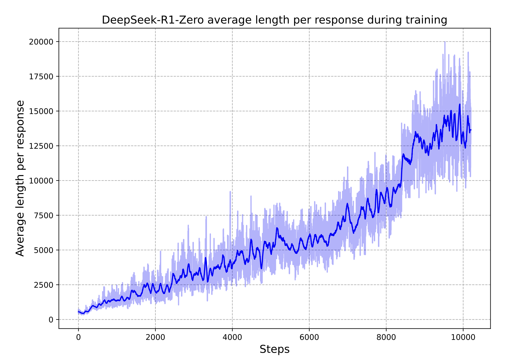



R1-Zero is the conceptual result. R1 is the engineering wrapping around it.

A reasoning model's trace looks structurally different from a standard LLM's. The model works through a problem, gets partway, says *wait, that's not quite right*, backs up, tries a different approach, checks the result against the constraints, notices the check failed, revises again, then commits. Thousands of tokens of exploration, self-correction, and hypothesis revision before the boxed answer.

Nobody wrote down the rule "if your first approach looks wrong, say *wait* and try a different one." Nobody curated a corpus of reasoning traces with backtracking and trained on them via SFT. The behavior consolidates out of a simple training procedure.

## R1-Zero is the result. Everything else is interpretation.

The setup is simple. Start from DeepSeek-V3-Base [@liu_etal_2024], a 671B model pretrained on text but never instruction-tuned. No SFT, no RLHF, no human-written reasoning examples.

Run GRPO on it (PPO with the critic removed and a group-relative advantage in its place; the [GRPO piece](/posts/series/how-llms-learn-to-reason/02-grpo/index.qmd) covers the details). Use math and code prompts where the answer is checkable. Two rewards:

- **Accuracy:** exact-match against the ground-truth answer for math, test execution for code.
- **Format:** the output uses the `<think>...</think><answer>...</answer>` template.

Both rule-based. No neural reward model, no process supervision, no verifier trained on preferences.

### What happens during training

AIME 2024 accuracy climbs from 15.6% to 71.0%, and to 86.7% with sixteen samples and majority voting [@guo_etal_2025]. The surprising part is response length. Average response length grows monotonically across training.

{#fig-r1zero-length fig-alt="Line chart from the DeepSeek-R1 paper: average response length per response versus training steps."}

The reward function never mentions length. The model discovers through trajectory comparison under GRPO that longer traces correlate with getting the answer right.

The paper flags an "aha moment": mid-derivation on a competition math problem, the model produces *Wait, wait. Wait. That's an aha moment I can flag here* and re-evaluates a step it was about to commit to. Self-reflective tokens (*wait*, *check*, *verify*, *mistake*, *wrong*) grow alongside response length. None were in the reward function or the prompt template. They appeared because trajectories that included them got reward more reliably than trajectories without them.

### What's actually happening

The mechanism is policy gradient on long trajectories with sparse terminal reward. You do many rollouts. Most fail. The verifier returns a single bit at the end of each: correct or not. That bit gets broadcast across every token of every successful trajectory. Whatever distinguished successful trajectories from failures, on average, gets reinforced: backtracking, self-checks, alternative approaches, length.

Karpathy calls this "sucking supervision through a straw." A minute of rollout updated by a single bit. It's crude credit assignment, and it works given enough samples and gradient steps.

### What R1-Zero shows

R1-Zero establishes an important claim: GRPO with rule-based verifiable rewards, on a sufficiently strong pretrained base model, consolidates latent reasoning behavior into a reliable long-CoT policy.

*Consolidates* is doing the work. Recent work on chain-of-thought decoding [@wang_zhou_2024] shows that reasoning traces, including backtracking and self-correction, are already present in pretrained models, just not at rank one in the next-token distribution. R1-Zero doesn't create reasoning behavior from nothing. It surfaces latent capability as a consistent policy, with trace lengths scaling up as the model discovers what gets rewarded.

## R1 is what you build when the policy needs to be a product

R1's contribution is different from R1-Zero's. It's the recipe for taking the raw reasoning behavior and making it a deployable assistant.

### Why R1-Zero isn't a product

R1-Zero mixes Chinese and English mid-trace and can produce correct math in prose so messy a user can't tell. The reasoning policy was optimized for one thing (getting the answer right under verification) and it shows.

### The four-stage pipeline

R1's pipeline addresses this in four stages:

1. **Cold-start SFT.** A few thousand long-CoT examples sampled from R1-Zero outputs, refined for readability and language consistency, used to fine-tune V3-Base. Gives the next RL stage a stylistically aligned starting point.
2. **R1-Zero-style RL.** GRPO on the cold-start checkpoint, same rule-based rewards plus a language-consistency reward to suppress mixing.
3. **Rejection sampling and second SFT.** The post-RL model generates reasoning trajectories filtered for correctness, combined with non-reasoning examples, and used for another round of SFT.
4. **Final RL.** Rule-based rewards on verifiable tasks combined with neural reward models on helpfulness and harmlessness, the latter trained on human preferences in the standard RLHF way.

## Test-time compute is downstream of training

Snell's result [@snell_etal_2024] predates R1 and shows that a smaller model with adaptive test-time compute can match a 14× larger model on easy and medium-difficulty problems. But Snell got there by building substantial external scaffolding around the base LLM: a separately trained process reward model (PRM; scoring intermediate steps of a reasoning trace), a revision model fine-tuned on self-correction trajectories, beam search over PRM outputs, best-of-N with verifier-weighted aggregation. The scaffolding extracts the gains.

R1 displaced the stack. No PRM. No beam search. No revision model. No best-of-N at inference. The model produces one long CoT in one decoding pass. The DeepSeek paper classifies PRMs and MCTS-style search (Monte Carlo Tree Search) as *unsuccessful attempts* in their own development.

The scaffolding got internalized into the policy via training. *Wait, that's wrong* is the model running its own verifier mid-trace. Backtracking is the model doing its own revision. Exploring an alternative approach is the model running its own search.

When somebody says a reasoning model "spends more compute at inference," what they usually mean is that the model produces a longer CoT. The longer CoT exists because training made the longer CoT effective.

## Verifiable rewards are the source and the boundary

Every successful application of this recipe shares a common feature: outcomes can be checked cheaply and unambiguously. Math problems with deterministic final answers. Coding problems with executable test suites. Formal theorem proving with proof checkers.

Reasoning behavior consolidates in R1-Zero because GRPO can attribute reward credit reliably across thousands of tokens based on a single end-of-trace check. The trace is long, the signal is sparse, the per-step contribution is invisible. None of that matters as long as the final-answer check is trustworthy. You compare trajectories, reward the ones that ended right, and over enough samples the policy gradient finds whatever in the middle of the trace was helping. Self-correction phrases, hypothesis exploration, longer length all win the comparison on average, when verification is reliable.

Run the same recipe with a learned reward model (say, a neural judge trained on human preferences for "good reasoning") and the signal becomes noisy and gameable under optimization pressure. Rule-based rewards on verifiable domains don't.

### The limits of the recipe

"Verifiable" is narrower than it sounds. Math has answer checking. Competition coding has test cases. But real software engineering, where "correct" includes design, readability, maintainability, and integration, is not verifiable in the R1 sense. The R1 recipe reaches the verifiable subset of code, not coding as a practice.

Even within verifiable domains, the recipe doesn't produce uniform competence. Recent empirical work [@shojaee_etal_2025] reports task-specific reliability ceilings: models collapse on puzzle instances of certain complexity even when nominally within their domain. Being inside a verifiable domain is necessary but not sufficient for reliable reasoning.

The same training that produces backtracking and self-correction can produce overthinking and second-guessing on tasks where the answer was obvious. R1 underperforms standard LLMs on instruction-following evaluations even while crushing AIME and Codeforces.

## What's next

R1-Zero is one demonstration in a broader pattern. The same recipe extends to multi-turn tool-using settings if outcomes remain verifiable. Search-R1 [@jin_etal_2025_searchr1] is the cleanest demonstration: extend the recipe to a model that interleaves reasoning with search-engine calls, and the model learns to use the tool well as part of its reasoning policy.

The [next piece](/posts/series/how-llms-learn-to-reason/05-tool-use/index.qmd) covers what changes when you move from single-turn verifiable reasoning to multi-turn tool-using settings and how the boundaries of "verifiable" get tested when you add tools and external state.

In the broader arc:

- [**PPO**](/posts/series/how-llms-learn-to-reason/01-ppo/index.qmd) is the workhorse algorithm.
- [**DPO**](/posts/series/how-llms-learn-to-reason/03-dpo/index.qmd) is the offline alternative.
- [**GRPO**](/posts/series/how-llms-learn-to-reason/02-grpo/index.qmd) is the variant for verifiable reward settings.
- **R1** is what GRPO produces when you point it at math and code on a strong base model.
