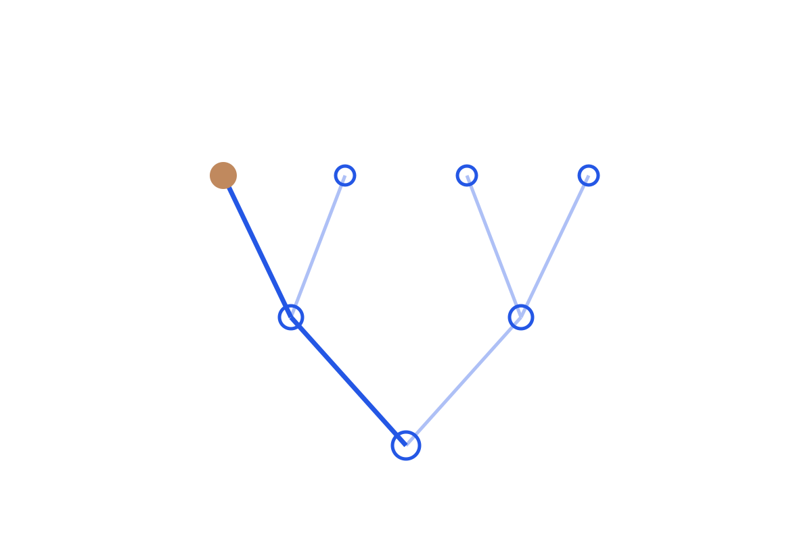

```{=html}

```

Reasoning models came out of a reinforcement-learning lineage: REINFORCE and PPO set the mechanics, GRPO and DPO reshaped the reward and update, tool-use RL extended it past single answers, and R1 made it shippable. The series follows the chain in order, so R1 reads as a consequence rather than a surprise.

Read in order:
