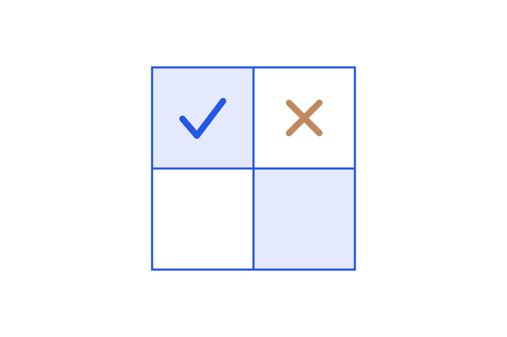

```{=html}

```

The series treats LLM evaluation as engineering: labels built from real traces, code checks before LLM judges, judges treated as calibrated classifiers, scores read as samples not truth, and an eval system you maintain like any other. The point is to know whether the system is actually getting better.

Read in order:
