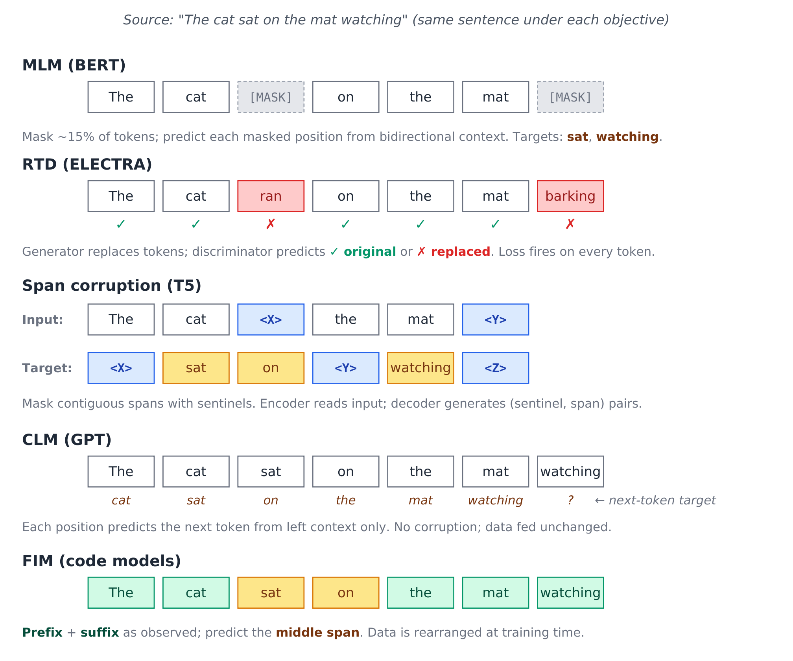



The standard tutorial story: "BERT was bidirectional, T5 was sequence-to-sequence, GPT was autoregressive, and decoder-only won because it was simpler." Sometimes "scaling worked better." Sometimes "instruction-tuning needed it."

I think this story is shallow. The objective didn't win; the paradigm did.

I've been writing about these architectures individually since late 2022: deep-dives on [transformer architecture](https://chanys.github.io/transformer-architecture/), [BERT](https://chanys.github.io/bert/), [RoBERTa](https://chanys.github.io/roberta/), [T5](https://chanys.github.io/t5/), [GPT-1](https://chanys.github.io/gpt1/), [ELECTRA](https://chanys.github.io/electra/), [DeBERTa](https://chanys.github.io/deberta/), [DeBERTa-v3](https://chanys.github.io/deberta-v3/), [UL2](https://chanys.github.io/ul2/), [FLAN](https://chanys.github.io/flan-palm/), and [LLaMA-2](https://chanys.github.io/llama2/) over at <https://chanys.github.io>. This article steps back from those individual treatments to make an argument those posts don't make explicitly: the field's reasons for converging on decoder-only are often misstated. Decoder-only did not win because causal language modeling was magically superior. It won because the decoder-only paradigm made pretraining, prompting, generation, inference, and deployment all line up.

## A short tour of the pretraining objectives

The objectives that defined the pretraining era can be characterized cleanly by what they hold out, what they leave visible, and which architectural family they imply. Throughout, let $x = (x_1, \ldots, x_n)$ be a sequence of tokens.

### Masked language modeling (MLM, BERT)

BERT's [@devlin_etal_2019] pretraining objective. Sample a set of positions $M \subset \{1, \ldots, n\}$ (typically 15% of tokens). For each $i \in M$, replace $x_i$ with a `[MASK]` token (80% of the time), a random token (10%), or leave it unchanged (10%). Train to predict the original tokens at the masked positions:

$$
\mathcal{L}_{\text{MLM}} = -\sum_{i \in M} \log P(x_i \mid \tilde{x}; \theta)
$$

where $\tilde{x}$ is the corrupted input. The loss only fires at the ~15% of positions that were sampled, so 85% of the input contributes to the gradient via attention but produces no direct prediction. The 80/10/10 mixing prevents the model from learning that `[MASK]` is the only token requiring prediction (see [BERT deep-dive](https://chanys.github.io/bert/) for more details).

The encoder is bidirectional: every position attends to every other position. However, the cost is that the model can't generate naturally, since at inference time you'd have to feed `[MASK]` tokens and the model isn't trained to compose tokens left-to-right.

### Replaced token detection (RTD, ELECTRA)

[ELECTRA](https://chanys.github.io/electra/) [@clark_etal_2020] replaces MLM with a discriminative objective. A small generator network (typically a smaller MLM model) replaces some tokens with plausible alternatives drawn from its own predictions.
A discriminator then predicts, *for every token*, whether it was original or replaced:

$$
\mathcal{L}_{\text{RTD}} = -\sum_{i=1}^{n} \big[ \mathbb{1}[x_i = \tilde{x}_i] \log D(\tilde{x}, i) + (1 - \mathbb{1}[x_i = \tilde{x}_i]) \log (1 - D(\tilde{x}, i)) \big]
$$
- RTD stands for **replaced token detection**.
- The indicator function $\mathbb{1}[x_i = \tilde{x}_i]=1$ if the token was not replaced, and $0$ if replaced.
- The discriminator $D(\tilde{x}, i) = P(\text{token at position } i \text{ is original}|\tilde{x})$.

Two architectural advantages over MLM: (1) loss fires on every token, not just 15%, giving roughly 4× sample efficiency; (2) the input the model sees at training matches its evaluation distribution (real-looking text), instead of `[MASK]`-laden gibberish.

At matched scale ELECTRA-Base outperforms BERT-Base on GLUE (85.1 vs 82.2 in the original paper), and ELECTRA-Large reaches RoBERTa-comparable [@liu_etal_2019] quality with under 1/4 the compute. The RTD objective got picked up later in DeBERTa-v3 [@he_etal_2021], which combines it with DeBERTa's disentangled attention.

### Span corruption (T5)

[T5](https://chanys.github.io/t5/) [@raffel_etal_2020] corrupts contiguous spans rather than individual tokens. Sample a set of spans (mean length 3, total ~15% of tokens), replace each span with a unique sentinel `<X>`, `<Y>`, `<Z>`, and train an encoder-decoder to autoregressively generate the missing spans as the target sequence. So with the original `The cat sat on the mat watching`:
- Encoder input: `The cat <X> the mat <Y>`
- Decoder target: `<X> sat on <Y> watching <Z>`

The decoder is autoregressive over the target, so the loss is:

$$
\mathcal{L}_{\text{SC}} = -\sum_{t=1}^{T} \log P(y_t \mid y_{<t}, \tilde{x}; \theta)
$$

This is generative: the decoder produces a sequence of tokens. But the corruption rate is low so most of the input stays observable to the encoder. T5 reframes a wide variety of NLP tasks (translation, summarization, classification, QA) as text-to-text under this objective.

### Causal language modeling (CLM, GPT)

The simplest objective. Predict each token from its left context:

$$
\mathcal{L}_{\text{CLM}} = -\sum_{i=1}^{n} \log P(x_i \mid x_{<i}; \theta)
$$

No masking, no replacement, no sentinels: the data is fed unchanged. Loss fires on every position. The architecture must use causal self-attention so position $i$ only sees positions $j < i$. The same parameters compute representations and generate tokens; there's no encoder-decoder split. See [GPT-1](https://chanys.github.io/gpt1/) [@radford_etal_2018] for more details.

### Mixture-of-denoisers (UL2)

[UL2](https://chanys.github.io/ul2/) [@tay_etal_2022] unifies multiple objectives within a single training run by mode-switching. Three denoising paradigms, signaled by special mode tokens (`[R]`, `[S]`, `[X]`) at the start of the sequence:
- **R-denoiser** (regular): standard T5-style span corruption (mean span length 3, ~15% rate).
- **S-denoiser** (sequential): prefix LM: split the sequence into prefix and target, and predict the target autoregressively given a bidirectional prefix.
- **X-denoiser** (extreme): aggressive corruption with long spans ($\geq 12$ tokens) or high rates ($\geq 30\%$).

The model learns to handle all three modes through the explicit mode tokens. UL2 reports that the mixture beats both pure CLM (GPT-style) and pure span corruption (T5-style) on a wide benchmark.

The interesting part for the argument here is that the S-denoiser is essentially CLM with a bidirectional prefix. In a normal causal LM, every token can only attend to previous tokens. In UL2’s S-denoiser / prefix-LM setup, the prefix is treated more like an encoder context: prefix tokens can see each other bidirectionally before the model starts generating the target.

UL2 explicitly recognizes prefix-LM as a useful interpolation between encoder-decoder and decoder-only.

### Fill-in-the-middle (FIM)

The infilling objective [@bavarian_etal_2022] used in code models (StarCoder, Code Llama, OpenAI Codex). Take a sequence, split into prefix, middle, and suffix, then *rearrange the data* and train autoregressively:

Training-time order: `<PRE> prefix <SUF> suffix <MID> middle`

This is just CLM on rearranged data. The model learns to generate `middle` conditioned on `prefix` and `suffix`, while remaining a pure decoder-only autoregressive language model. The cleverness is in the data layout, not the objective. The inference-time prompt is `<PRE> {user_prefix} <SUF> {user_suffix} <MID>`, after which the model autoregressively generates the missing middle.

This pattern of getting a span-fill capability by rearranging data into a CLM-shaped task, is a recurring theme in what comes next.

{#fig-objectives fig-alt="The same sentence shown five times, once per pretraining objective, with different tokens masked or held out in each copy to illustrate how each objective changes which tokens the model must predict"}

## Architecture is mostly an attention pattern

The key move is to stop treating encoder, encoder-decoder, and decoder-only models as completely separate species. At the transformer level, much of the difference comes down to which tokens are allowed to attend to which other tokens.

![Attention masks across the three transformer families. Filled cells indicate attendable positions; the encoder-decoder panel shows the joint attention pattern over a concatenated [encoder, decoder] sequence.](attention_masks.png){#fig-attention-masks fig-alt="Three grid diagrams of attention masks: a fully filled bidirectional grid for the encoder, a lower-triangular causal grid for the decoder, and an encoder-decoder grid over a concatenated encoder then decoder sequence showing full attention within the encoder block and causal plus cross attention in the decoder block"}

An encoder gives every token bidirectional access to every other token. A decoder-only model gives each token access only to earlier tokens. An encoder-decoder splits the computation into two parts: the encoder reads the input bidirectionally, while the decoder generates the output autoregressively while attending back to the encoder. These are different attention patterns over tokens.

This matters because some capabilities that look architecture-specific can be recovered by changing the data layout. Prefix-LM gives a decoder-style model bidirectional access to a prefix before generating a continuation. Fill-in-the-middle gives a decoder-only model infilling behavior by rearranging the sequence into prefix, suffix, then middle. Span corruption can be viewed similarly: decide what is visible, decide what is hidden, then train the model to predict the missing text.

So the important question is not simply, "Which objective is best?" The better question is: Which training setup gives the most useful capabilities per unit of data, compute, and deployment complexity?

From that angle, decoder-only models had a major advantage. They could absorb many task formats into a single pattern: put context in the prefix, then generate the continuation.

The claim is not that CLM is theoretically superior to every denoising objective. The claim is that decoder-only made the fewest assumptions about the shape of the task. Once everything can be represented as context followed by continuation, the same model can support pretraining, instruction following, few-shot prompting, chat, tool use, and long-form generation without changing architecture.

## At small scale, objective matters more

At small scale, pretraining objectives strongly shape what the model learns efficiently.

BERT-style MLM gives the model a bidirectional bias, which helps classification, sequence labeling, and extraction. ELECTRA improves sample efficiency by producing a learning signal at every token. T5-style span corruption gives the model a natural input-output format for tasks like summarization and translation.

These advantages are real, but they become less decisive as models scale. The objectives are not equivalent, but they all train on the same underlying distribution of language. At large scale, each objective still pushes the model to learn many of the same patterns: syntax, semantics, factual associations, discourse structure, and task formats. The objective matters, but it no longer dominates general-purpose capability the way it does at small scale.

So the question gradually shifts from "Which objective gives the best inductive bias?" to "Which architecture is easiest to scale, prompt, serve, and adapt?"

That changes the tradeoff. Once objective-level advantages become less dominant, the practical advantages of decoder-only become harder to ignore: simpler data preparation, direct autoregressive generation, natural prompting, easier serving, and a single architecture for many behaviors.

So the point is not that MLM, span corruption, or RTD were bad ideas. The point is that their advantages mattered most in regimes where model size, data scale, and deployment patterns looked very different from modern LLMs.

## The actual reason decoder-only won: unification

Decoder-only did not win because MLM was "wrong" or span corruption was "worse." It won because the field moved from many specialized NLP tasks toward one general-purpose modeling interface.

BERT-style models were excellent for classification, sequence labeling, span extraction, and retrieval. But each task usually required a specific setup: a head, a pooling strategy, a masking scheme, or a fine-tuned output format.

Decoder-only models made the interface much simpler: *Put the context in the prefix, then generate the continuation.*

That one pattern absorbs many tasks. Classification becomes completion. Question answering becomes completion. Dialogue becomes completion. Code generation becomes completion. Tool use becomes completion over an action-observation trace.

So the deeper reason decoder-only won is unification: many task formats became one modeling problem: context in, continuation out.

**1. One interface for many tasks.**
Decoder-only models turn many tasks into the same pattern: put the task description, examples, prior turns, or tool outputs in the prefix, then generate the continuation. Classification, QA, dialogue, code generation, and tool use all become variations of completion.

**2. Flexible training data.**
CLM trains directly on raw token sequences. No masking, span sampling, task-specific heads, or encoder-decoder split. Documents, code, conversations, transcripts, math, and structured text can all be modeled in the same format.

**3. Training matches inference.**
Modern LLM use is generative: chat, instruction following, summarization, code generation, agents, and tool use. Decoder-only models are trained in the same mode in which they are used: condition on previous tokens, then generate the next ones. Encoders remain excellent representation learners, but open-ended generation is not their native mode.

**4. New capabilities become formatting problems.**
Decoder-only models can absorb behaviors that once looked like they required specialized objectives. Fill-in-the-middle reframes span filling as autoregressive prediction over rearranged data. Instruction tuning, chat formatting, tool traces, and preference tuning follow the same pattern: keep the architecture fixed, change the data format and training signal.

The production benefits follow from this unification. One architecture is easier to scale, cache, batch, serve, and adapt than a collection of task-specific modeling setups.

## What encoders still do

This story is specifically about general-purpose generative LLMs. It is not a story about encoders becoming useless. Encoders did not disappear; they specialized.

Encoders are still the right tool when:
- The output is structured per-token (named entity recognition, sequence labeling, span extraction).
- The output is a fixed-length representation of the whole input (sentence embeddings, classification, retrieval).
- The latency budget rules out autoregressive generation.
- The downstream task has small training data and benefits from the strong inductive bias of bidirectional MLM pretraining.

[DeBERTa-v3](https://chanys.github.io/deberta-v3/) is in many ways the high-water mark of encoder pretraining, and it's still the model I reach for on small-data IE tasks. The disentangled attention from [DeBERTa](https://chanys.github.io/deberta/), the [RTD objective from ELECTRA](https://chanys.github.io/electra/), and DeBERTa-v3's gradient-disentangled embedding sharing combine into a hard-to-beat package below 1B parameters.

The mistake is to turn "decoder-only won general-purpose generation" into "encoders are obsolete." It doesn't. For the IE-shaped tasks they were always good at, they're still ahead of decoder-only models on a Pareto frontier of accuracy and inference cost.

## Code companion: where this shows up in TNLP

The TNLP repo at <https://github.com/chanys/tnlp> contains working examples for the model families discussed in this article and the rest of the foundations series.

The examples most relevant to this article are:
- **Token classification / NER**: DeBERTa-v3 base with a token classification head on CoNLL-2003. This is the classic encoder use case: one contextual representation per token, one label per token.
- **Span-pair classification / relation extraction**: DeBERTa-v3 with custom span-pair pooling on NYT-H. This shows why encoders remain useful for information extraction: they produce cheap, dense representations over the whole sentence.
- **Contrastive modeling / retrieval**: E5 and DeBERTa-based triplet-loss models on BioASQ11. This connects directly to the [next article](/posts/series/research-foundations-of-modern-llms/02-encoder-embeddings/index.qmd): encoders did not disappear; they became embedding and retrieval models.

The same repo also includes examples from the other branches of the pretraining story:
- **FLAN-T5 seq2seq examples**, representing the encoder-decoder path.
- **LLaMA-2 and [Mistral](https://chanys.github.io/mistral/) instruction/chat tuning**, representing the decoder-only path after CLM pretraining.
- **[DPO](https://chanys.github.io/dpo/) examples**, representing the alignment stage that comes after supervised instruction tuning.

I will return to these examples in later articles. For this piece, the main point is narrower: the old pretraining families did not vanish. They separated into different roles. Decoder-only became the default for general-purpose generation, while encoders remained highly useful for embeddings, retrieval, classification, and information extraction.

