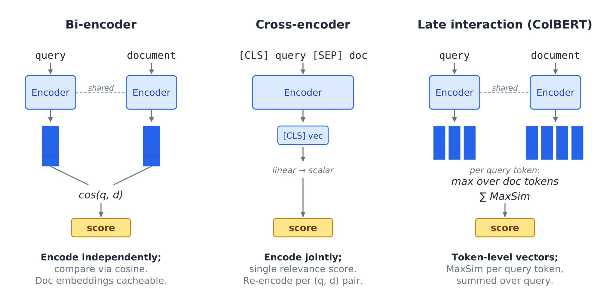



The LLM story is usually told as a generation story: GPT scaling, instruction tuning, RLHF, chat, agents.

But most LLM-powered systems also depend on a quieter model running in the background: an embedding model. RAG, semantic search, reranking, clustering, recommendation, deduplication, and classification all depend on embeddings. The generator gets the headlines, but the embedding model often decides what the generator gets to see.

This is where encoders went.

The [previous article](/posts/series/research-foundations-of-modern-llms/01-pretraining-objectives/index.qmd) argued that decoder-only models won the general-purpose generation interface. This article makes the complementary argument: encoders didn't die. They became the default architecture for turning text into reusable vectors.

More precisely, the embedding role was won by encoder-style machinery: bidirectional attention, pooled output representations, and contrastive fine-tuning. Even modern decoder-based embedders often move in this direction during fine-tuning, relaxing causal attention and training the model to produce reusable vectors.

I have been circling this topic for a while. Since late 2022, I have written separate deep dives on [SBERT](https://chanys.github.io/sbert/), [SGPT](https://chanys.github.io/sgpt/), [MTEB](https://chanys.github.io/mteb-dataset/), [MPNet](https://chanys.github.io/mpnet/), [PLM/XLNet](https://chanys.github.io/plm/), [knowledge distillation and DistilBERT](https://chanys.github.io/knowledge-distillation/), and the relevant [loss functions](https://chanys.github.io/loss-functions/) and [KNN search](https://chanys.github.io/knn/) over at <https://chanys.github.io>. Those posts covered the individual papers and techniques; this article steps back from them to make the broader point.

It is also a bridge between those older paper notes and the [TNLP codebase](https://github.com/chanys/tnlp): the paper trail explains the ideas, and the code shows what they look like when implemented.

One terminology clarification before going further. "Embedding" refers to two different things: the token embedding table, which maps token IDs to input vectors, and the output embedding, which is the pooled vector representing a sentence, paragraph, or document. When practitioners today say "an embedding," they usually mean the latter. This article is about the latter.

## Where embeddings actually live in modern systems

Embeddings are the input layer of many AI systems. They show up anywhere we need to turn text into something searchable, comparable, clusterable, or rankable.

- **Retrieval (RAG).** Embed the document corpus once, index the vectors in a vector database, embed the query at runtime, and retrieve nearest neighbors. If the embedding model can't tell that "what causes type 2 diabetes" and "diabetes risk factors" should be close, the RAG system breaks before the LLM ever sees the query.
- **Reranking.** Retrieval gives you candidates; a stronger model reranks the top results. This second model is often a cross-encoder, another transformer encoder used in a different way.
- **Classification heads.** Encode text once, then run a classifier for sentiment, intent, moderation, or routing. The "encoder plus linear head" recipe predates BERT, but BERT made it the default.
- **Semantic deduplication.** Large training datasets need more than exact-match deduplication. Embeddings catch near-duplicates that lexical matching misses.
- **Clustering and topic discovery.** Embed a document collection, cluster the vectors, then inspect the clusters. This is a standard recipe for analyzing customer feedback, support tickets, or other text corpora.
- **Recommendation and semantic search.** User embeddings, item embeddings, query-item matching, and document search are all variations of the same idea: represent things as vectors, then compare them.

The practical test is simple: pick an LLM-powered product and ask where the embedding model is. In many systems, it is doing critical work before the LLM ever sees the prompt.

## How a modern embedding model is built

A modern embedding model is usually built in two stages.

First, start with a pretrained language model backbone. For encoder-based embedders, this is often a BERT-like, MPNet-like, or DeBERTa-like model trained with MLM, RTD, or a related objective. Pretraining gives the model general language understanding: syntax, semantics, factual associations, and domain patterns.

Second, fine-tune it contrastively. This is the step that turns a language model into an embedding model.

Raw pretrained representations are not automatically good sentence embeddings. If you simply pool BERT outputs and compare them with cosine similarity, the geometry is often poor [@ethayarajh_2019; @li_etal_2020]: unrelated texts can still end up with surprisingly high similarity scores. Sentence-BERT [@reimers_gurevych_2019] made this practical problem visible.

Contrastive training fixes the geometry by pulling related texts closer and pushing unrelated texts farther apart. The result is an embedding space where cosine similarity becomes useful for retrieval, clustering, classification, and semantic matching.

The key distinction is simple: pretraining gives the model language understanding; contrastive fine-tuning gives it useful embedding geometry.

### Pooling

Transformers produce one vector per token. Embedding systems usually need one vector for the whole input, so they need a pooling strategy.

Mean pooling is the safest encoder default: average the token representations. `[CLS]` pooling can work, but only if the model was trained to make `[CLS]` meaningful. Raw BERT `[CLS]` is usually weak for sentence similarity. Last-token pooling is common in decoder-based embedders, where the final token has seen the previous context.

## How embedding models are used for retrieval

Once you have an embedding model, the next question is how to use it to score query-document relevance.

{#fig-similarity-architectures fig-alt="Three side-by-side architecture diagrams. Left, a bi-encoder: query and document go through separate encoder towers into one vector each, compared by a single similarity score. Middle, a cross-encoder: the concatenated query and document go through one shared encoder that outputs a single relevance score. Right, late interaction: both are encoded but token-level vectors are kept, and the score is the sum over query tokens of each token's maximum similarity to any document token."}

**Bi-encoder.** Encode the query and document separately, then compare their vectors. Document vectors can be precomputed, so this is the standard choice for first-stage retrieval.

**Cross-encoder.** Encode the query and document together, then output a relevance score. This is usually more accurate, but too expensive to run over an entire corpus.

**Late interaction.** Models like [ColBERT](https://chanys.github.io/colbert/) [@khattab_zaharia_2020] keep token-level vectors and compare query tokens against document tokens. This sits between bi-encoders and cross-encoders in both cost and accuracy.

The standard production recipe is simple: bi-encoder for retrieval; cross-encoder or late-interaction model for reranking.

## Code companion: the TNLP embedding experiments

The [TNLP repo](https://github.com/chanys/tnlp) has my working code for the ideas in this article. The most relevant example is a pair of contrastive-training experiments on BioASQ11, a biomedical retrieval dataset with questions, chosen answers, and rejected PubMed snippets. Both experiments train the same behavior: pull the query and chosen answer closer, push the rejected candidate farther away.

I implemented this two ways, to show two real workflows.

The first uses `sentence-transformers` with `intfloat/e5-base-v2` [@wang_etal_2022]: take a strong existing embedder, rely on the library, and fine-tune with relatively little code. This is what *adapting an existing embedding model to your domain* looks like in practice.

The second uses a custom DeBERTa-v3 triplet model with a hand-rolled training loop. Every hidden choice becomes visible: backbone, pooling, projection, distance function, triplet construction, loss. This is what *turning a pretrained encoder into an embedding model yourself* looks like, when you can't or don't want to lean on the library defaults.

The two are not a head-to-head benchmark. E5 is already contrastively pretrained; DeBERTa-v3 is a general encoder backbone. They're paired here because together they cover the two starting points a real production team faces.

## Decoder-only models can do embeddings too

The article so far has argued that encoder-style machinery won the embedding role. That does not mean only encoder backbones can produce embeddings. Decoder-only models can, and recent work has pushed this direction hard.

The early version of this idea was [SGPT](https://chanys.github.io/sgpt/) [@muennighoff_2022]: take a GPT-style decoder-only model, pool token representations with a position-weighted mean, and contrastively fine-tune for semantic search. It worked, but it was expensive relative to encoder-based alternatives.

The current generation is stronger. Large decoder backbones (Llama, Mistral) can be turned into embedders that compete at the top of MTEB [@muennighoff_etal_2022], especially on retrieval and reranking. But notice the recipe they converge on: take a strong decoder-only LLM, relax or replace causal attention during fine-tuning, pool the output representations, and contrastively fine-tune on a large mix of data.

That recipe looks encoder-like. Bidirectional access, pooled output, contrastive geometry. The starting weights may come from a decoder-only LLM, but the embedding behavior is built by the fine-tuning stage.

So "decoders caught up" is only half right. The better framing is that large decoder backbones can be adapted into strong embedders when the fine-tuning recipe starts to look encoder-like. For most production systems, small encoder-based embedders remain attractive because they are fast and cheap. For highest-quality retrieval where compute is available, large decoder-based embedders are now real competitors.

## Closing

Decoder-only models won the visible part of the LLM story: generation, chat, instruction following, agents.

But encoder-style machinery won a quieter role: bidirectional access, pooled output representations, and contrastive fine-tuning. That machinery became the default way to turn text into reusable vectors, and it now powers retrieval, reranking, clustering, classification, deduplication, and semantic search across the modern AI stack.

That is why the encoder did not die. It moved into the infrastructure.

The [next article](/posts/series/research-foundations-of-modern-llms/03-retrieval/index.qmd) picks up where this one leaves off: how the retrieval part of RAG was solved well before "RAG" became the popular term, from Dense Passage Retrieval through end-to-end joint training of retriever and generator.

