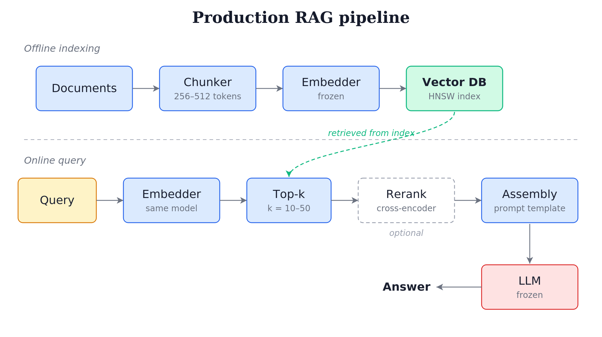



Most production RAG systems today are simple pipelines: a frozen embedding model, a vector database, and a frozen LLM connected by prompt assembly. That is closer to **Dense Passage Retrieval** ([DPR](https://chanys.github.io/dpr/)), the 2020 bi-encoder retrieval method from Karpukhin et al. [@karpukhin_etal_2020] with a generator, than to the original [RAG](https://chanys.github.io/rag/) paper [@lewis_etal_2020], which proposed joint training of the retriever and generator with marginalization over retrieved documents.

This article builds on paper-by-paper notes I wrote on <https://chanys.github.io> between 2022 and 2023. Those posts explain the individual papers. Here, I step back and connect them into a larger story: retrieval was already a mature technical lineage before "RAG" became the umbrella term. Later, I also point to my [TNLP](https://github.com/chanys/tnlp) code that implements the more expensive end-to-end version.

## What RAG meant in 2020 vs what it means today

The Lewis et al. (2020) paper proposed:
1. A DPR-style bi-encoder retriever
2. A BART seq2seq generator
3. **Joint training** of query encoder and generator (document encoder frozen)

What most production RAG deploys:
1. An off-the-shelf embedding model (BGE, E5, OpenAI text-embedding-3, Cohere), frozen
2. A vector database (Pinecone, Weaviate, Qdrant, Milvus, pgvector, Chroma)
3. An LLM API (OpenAI, Anthropic, Google), frozen
4. **No joint training**

This isn't a critique. The simpler pattern works well for many use cases, doesn't require ML engineering depth, and decouples the retriever from the generator.

## A short history of dense retrieval

The history below is the chronology that produced the drift. Each step changed what was possible, and most of the production world adopted only part of what each step demonstrated. The story is short because it happened fast: almost all the field-defining work landed between 2020 and 2023, on top of a lexical baseline (BM25) you still need.

{#fig-retrieval-lineage fig-alt="A swim-lane timeline with four lanes from top to bottom: joint training, late interaction, bi-encoder dense, and lexical. The x-axis is years, with 2009 on the left, then an axis break, then 2020, 2021, 2022, 2023. BM25 sits alone in the lexical lane at 2009. In 2020 four papers appear across three lanes: REALM and RAG on the joint-training lane, ColBERT on the late-interaction lane, DPR on the bi-encoder-dense lane. ColBERTv2 follows in 2021 on the late-interaction lane. End-to-end RAG appears in 2022 and RA-DIT in 2023, both on the joint-training lane. DPR is highlighted with a thicker border and a light indigo fill, with the label production sits here directly below it. The bi-encoder-dense lane is empty to the right of DPR while the joint-training lane keeps going. Caption: production rode the bi-encoder and stopped at DPR; the joint-training lineage is what got skipped."}

### BM25 [@robertson_zaragoza_2009]

The baseline that wouldn't die. Lexical ranking over inverted indices, using TF-IDF with length normalization and term saturation. For roughly two decades, BM25 was the baseline neural methods couldn't consistently beat. DPR's primary contribution was beating it cleanly enough that the field finally moved on, but BM25 didn't go away: hybrid setups (BM25 + dense, often with reciprocal rank fusion [@cormack_etal_2009]) are common in production today, and pure-dense systems frequently lose to hybrid on tasks with rare-term queries.

### [REALM](https://chanys.github.io/realm/) [@guu_etal_2020]

Two months before DPR, REALM proposed something more ambitious: retrieval-augmented language model pretraining, with the retriever trained jointly with the generator from MLM signal. It got far less production traction than DPR because joint pretraining was expensive, and DPR's recipe was simpler and more transferable.

### [DPR](https://chanys.github.io/dpr/) [@karpukhin_etal_2020]

The paper that made bi-encoder dense retrieval practical. Two BERT encoders, $E_Q$ for queries and $E_P$ for passages. Score by inner product. Train with the negative log-likelihood of the positive passage against negatives (both explicit hard negatives, and in-batch negatives where the positives of other examples in the same batch serve as negatives):

$$\mathcal{L}(q_i, p_i^+, p_{i,1}^-, \ldots, p_{i,n}^-) = -\log \frac{e^{\mathrm{sim}(q_i, p_i^+)}}{e^{\mathrm{sim}(q_i, p_i^+)} + \sum_j e^{\mathrm{sim}(q_i, p_{i,j}^-)}}$$

The contributions were practical: in-batch negatives (free supervision), independent encoders for query and passage (asymmetric architecture for asymmetric inputs), and a clean training recipe. The result was the first dense retriever to consistently beat BM25 on open-domain QA.

DPR's bi-encoder is the architecture that most RAG systems still use, with newer embedding models in place of BERT. The drift starts here: the production world adopted DPR's architecture but not its training discipline.

### [RAG](https://chanys.github.io/rag/) [@lewis_etal_2020]

The paper RAG got its name from, and the one production drift moved furthest away from. DPR retriever plus BART seq2seq generator, jointly fine-tunable. The RAG-token model marginalizes over the top-k retrieved documents per output token:

$$p_\mathrm{RAG\text{-}Token}(y|x) \approx \prod_{i=1}^N \sum_{z \in \mathrm{top\text{-}}k(p(\cdot|x))} p_\mathrm{DPR}(z|x) \cdot p_\theta(y_i | x, z, y_{1:i-1})$$

Two important details. First, only the **query encoder** is updated during training; the document encoder (and the FAISS index) stay frozen. Re-encoding the corpus during training is too expensive. Second, the marginalization is per-token: at every output token, the model sums the probability of that token across the retrieved documents weighted by retrieval probability. This is genuinely different from concatenating top-k documents and running a single forward pass, which is what most production RAG does.

### [ColBERT](https://chanys.github.io/colbert/) [@khattab_zaharia_2020]

Late interaction was the path the field didn't ultimately take, though it remains the most interesting compromise between bi-encoder speed and cross-encoder accuracy. Encode query and document independently with BERT, then compute similarity at the token level:

$$S_{q,d} = \sum_{i \in E_q} \max_{j \in E_d} \left( E_{q_i} \cdot E_{d_j}^\top \right)$$

For each query token, find the most similar document token, sum the maxima. Encoding stays independent (documents can be indexed offline), but the matching is fine-grained. The cost is storage: ColBERT stores one vector per token instead of one per document, roughly 100x for a 100-token document. That's its main operational drawback.

### [ColBERTv2](https://chanys.github.io/colbertv2/) [@santhanam_etal_2021]

Same architecture with two improvements: residual quantization (cluster the per-token embeddings, store each as `(centroid_id, residual)` with a 2-bit residual; storage drops 6-10x), and distillation from a cross-encoder. ColBERT and ColBERTv2 are the canonical late-interaction systems, and they work at scale. But modern strong bi-encoders have closed enough of the gap that the storage cost is hard to justify for most use cases.

### [End-to-end RAG](https://chanys.github.io/rag-domain-qa/) [@siriwardhana_etal_2023]

If the original RAG paper described joint training with a frozen document encoder, this is the paper that made even the document encoder trainable. The engineering cost is what most teams won't pay.

The original RAG paper kept the document encoder frozen during training because re-encoding the corpus was too expensive. End-to-end RAG removes that constraint with two asynchronous processes: one continuously re-encodes passages with the updated document encoder, and one rebuilds the index. Training proceeds in parallel; the index is updated periodically with the latest version of the encoder.

This makes joint training of all components feasible: query encoder, document encoder, and generator. The paper also adds an auxiliary loss: regenerate the input query from the retrieved passages. This forces the retriever to find passages that contain enough information to reconstruct the query, which is a useful signal when domain-specific labels are scarce.

This is the closest to a "real" end-to-end retrieval-augmented model. The async re-encoding pipeline is the cost most production teams won't pay.

### [RA-DIT](https://chanys.github.io/radit/) [@lin_etal_2023]

The practical answer to the engineering question end-to-end RAG raises: how do you get most of the benefit of joint training without the async re-indexing pipeline? Two separate fine-tunings, run in sequence. First, fine-tune the LLM to use retrieved chunks. Second, fine-tune the retriever using LM-supervised retrieval (LSR): score documents by how much they raise the LM's probability of the correct output:

$$p_\mathrm{LSR}(c | x, y) \propto \frac{\exp\left( p_\mathrm{LM}(y | c \circ x) / \tau \right)}{\sum_{c' \in C'} \exp\left( p_\mathrm{LM}(y | c' \circ x) / \tau \right)}$$

Only the query encoder is updated; the document encoder stays frozen. The two stages can each be done with standard fine-tuning infrastructure. The paper reports SOTA results on MMLU, NQ, TriviaQA, and KILT subsets with a 65B-parameter LLM.

## The retrieval pattern most production systems actually use

Setting aside the joint-training story, here is the pipeline most teams have built. The bi-encoder/cross-encoder split is the operational story; everything else is supporting infrastructure.

{#fig-rag-pipeline fig-alt="A two-row pipeline diagram. The top row is offline indexing: source documents are chunked, embedded, and written into a vector index, run once. The bottom row is the online query path: a user query is embedded, used to retrieve candidate chunks from the same vector index, passed through an optional reranker stage, and the top results plus the query are sent to the generator to produce the answer. An arrow shows the vector index built in the top row being read by every request in the bottom row."}

**Chunking.** Source documents are split into chunks. Fixed-token chunking (256-512 tokens with 10-20% overlap) is the default and works well enough for most prose. Recursive chunking respects document structure (Markdown headers, paragraph breaks). Semantic chunking (splitting on sentence-embedding distance) is more expensive and rarely justifies the cost on standard text. The ceiling on retrieval quality is often set here: chunks too small lose context, chunks too large produce diffuse embeddings that match weakly. The default chunker in the framework is rarely the right one for your data: PDFs with tables, code with function boundaries, and Markdown with structured sections each need different handling.

**Embedding.** Each chunk is encoded once with a frozen embedding model.

**Vector database.** The encoded chunks live in a vector index, e.g. HNSW or IVF-PQ under the hood. Pinecone, Weaviate, Qdrant, Milvus, pgvector, Chroma: pick on operational fit, not on retrieval quality. The choice of embedding model and chunking strategy usually dominates. pgvector is increasingly competitive when your data is already in Postgres and you don't want a second system to operate. For the indexing intuition behind approximate nearest-neighbor search and product quantization, see my earlier [KNN search note](https://chanys.github.io/knn/).

**Top-k retrieval.** Encode the query with the same embedding model used at indexing time, retrieve top-$k$ by cosine similarity (or dot product if vectors are normalized). Typical $k$ is 10-50. Larger $k$ is wasted unless you rerank.

**Reranking (optional but usually worth it).** A cross-encoder reranker takes the query and each retrieved chunk together and produces a relevance score. The bi-encoder is fast but cannot model query-document interactions; the cross-encoder can. Bi-encoder retrieves 50, cross-encoder reranks to top 5-10. The off-the-shelf rerankers in 2024-2025 are strong enough that the "no reranker" failure mode is increasingly hard to justify: [BGE-reranker-v2-m3](https://huggingface.co/BAAI/bge-reranker-v2-m3), [Cohere Rerank 3](https://docs.cohere.com/docs/reranking-with-cohere), [mxbai-rerank-large-v1](https://huggingface.co/mixedbread-ai/mxbai-rerank-large-v1), and [Jina Reranker v2](https://jina.ai/models/jina-reranker-v2-base-multilingual/) are all usable before you train your own reranker.

A note on the bi-encoder vs cross-encoder choice: cross-encoders score query-document pairs jointly, so they cannot be precomputed. Running one over millions of documents at query time is infeasible. They belong in reranking, after a bi-encoder narrows the candidates.

**Context assembly.** A prompt template combines the system instruction, the retrieved-and-reranked chunks, and the query. Order matters: long-context models attend more to the start and end of the prompt than to the middle (the "lost in the middle" effect). Some systems include chunk metadata (source URL, section title) to help the LLM cite.

**LLM call.** Frozen API or local model. The LLM generates the answer from the assembled prompt.

This pipeline is what most blog posts mean when they say RAG. It's also what most teams should build first before they consider anything more complex.

## Code companion: TNLP end-to-end RAG

Most production RAG systems stop at frozen retrieval plus prompt assembly. In [TNLP](https://github.com/chanys/tnlp), I implemented the more expensive pattern: end-to-end RAG with retriever-generator coupling and asynchronous index refresh.

The point of the exercise isn't that everyone should joint-train. Most teams shouldn't. The point is to make the distinction concrete: production RAG is usually a pipeline; end-to-end RAG is a trained retrieval-augmented model.

## RAG evaluation

Three things tend to go wrong when teams evaluate this pipeline.

1. **Treating RAG as monolithic.** RAG is a pipeline. Each stage (chunking, embedding, retrieval, reranking, prompt assembly, generation) has its own quality and latency tradeoffs. "Our RAG isn't working" is rarely diagnosed by treating the system as a black box.

2. **Vibes-only evaluation.** ["It seems to work" is not evaluation](/posts/series/llm-evaluation-honestly/01-stop-vibe-checking/index.qmd). At minimum: a labeled set of (query, relevant_chunk) pairs, [retrieval metrics](https://chanys.github.io/ir-metrics/) on a held-out set, and end-to-end answer correctness. Without these, you don't know whether the embedding model, the reranker, or the LLM is failing.

3. **Not measuring retrieval recall before LLM accuracy.** If the relevant chunks aren't retrieved, no LLM can save you. Measure [retrieval recall@k](/posts/series/llm-evaluation-honestly/06-rag-evaluation/index.qmd) first, then end-to-end accuracy.

## Closing

The retrieval lineage from DPR through RA-DIT is a story of escalating sophistication: bi-encoder dense retrieval, then joint training with a frozen index, then joint training with an updating index, then a two-stage practical compromise. Production RAG, meanwhile, mostly stopped at step one. The simpler pattern works well for most use cases, and the engineering cost of going further is real.

But the gap is worth knowing. When the off-the-shelf pipeline isn't working on your data, the next step isn't to swap embedding models or try another vector database. It's to figure out where in the pipeline the loss is happening, and whether the answer is a configuration change, a fine-tune, or the more ambitious territory the original RAG paper was actually about.
