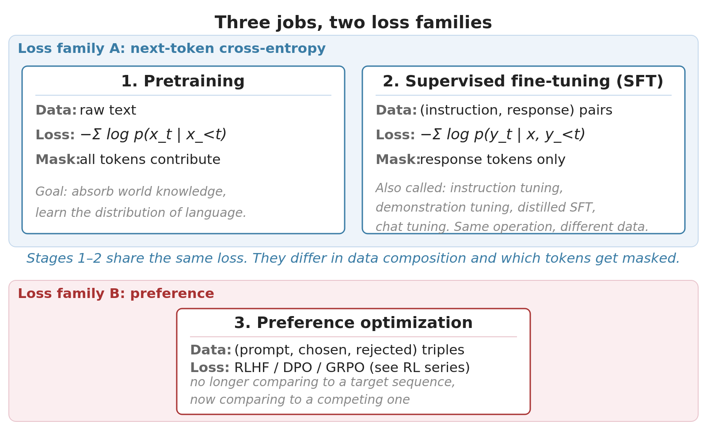



The standard story about post-pretraining is: first supervised fine-tuning (often called instruction tuning), then alignment with RLHF or DPO. Two stages, presented as several distinct techniques because the SFT stage has gone by many names: supervised fine-tuning, instruction tuning, distilled SFT, chat tuning. Mechanically, they're the same operation.

SFT shares its loss function with pretraining. They're both next-token cross-entropy, differing only in what data goes in and which tokens contribute to the loss. Preference optimization is the only stage that introduces a genuinely new loss family.

## Two loss families across three stages

{#fig-three-jobs fig-alt="A diagram of three training stages grouped by loss family. Pretraining and supervised fine-tuning are bracketed together as one group because both use next-token cross-entropy; the diagram contrasts them only by their input data and by which tokens contribute to the loss. Preference optimization sits in a separate group, labeled as the only stage that introduces a different loss family."}

Pretraining and SFT use the same loss: next-token cross-entropy. They differ in:

- **What data the model sees.** Raw text for pretraining; (instruction, response) pairs for SFT.
- **Which tokens contribute to the loss.** All tokens for pretraining; only response tokens for SFT (the prompt is masked out).

That's the whole mechanical difference. SFT is pretraining on more curated data with a loss mask on the prompt.

Preference optimization is the only stage that introduces a new loss family. The output is no longer compared to a target sequence; it's compared to a *competing* sequence under a preference framework. RLHF wraps this in a reward model and PPO; [DPO](https://chanys.github.io/dpo/) [@rafailov_etal_2023] collapses the same idea into a single supervised loss; GRPO replaces the value network with group statistics. Each has its own deep-dive in this site's RL series: [PPO is REINFORCE Plus Five Fixes](/posts/series/how-llms-learn-to-reason/01-ppo/index.qmd), [DPO: RLHF Collapsed Into One Loss](/posts/series/how-llms-learn-to-reason/03-dpo/index.qmd), and [GRPO: The Algorithm Behind Reasoning Models](/posts/series/how-llms-learn-to-reason/02-grpo/index.qmd).

## Supervised fine-tuning

SFT's loss is the same as pretraining's. Everything interesting is in the data.

The mechanics, traced through one example. Take an instruction-response pair:

- **Instruction**: "Classify the sentiment of this review and explain why: 'The food was great but the service was terrible.'"
- **Response**: "Mixed sentiment. The reviewer praises the food but criticizes the service."

You concatenate the instruction and response into a single sequence and feed it through the model. The model computes next-token cross-entropy as it would in pretraining. The difference: a loss mask zeros out the contribution from instruction tokens. Only the response tokens carry gradient.

The wrong reading is that the model learns to generate instruction-and-response pairs. It doesn't. The instruction tokens have no loss contribution, so the model gets no gradient signal saying "produce instructions like these." What the model learns is to produce response tokens given the instruction tokens as context. At inference, you provide the instruction; the model continues with the response.

That's it for the loss. Everything else is data engineering. SFT data comes in a few forms:

**Human-written demonstrations.** The original [InstructGPT](https://chanys.github.io/chatgpt/) [@ouyang_etal_2022] recipe: humans wrote responses to a curated set of instructions, and the model was fine-tuned on those pairs. High-quality, but expensive and slow.

**Multitask instruction data.** The Sept 2021 [FLAN](https://chanys.github.io/flan/) [@wei_etal_2022] paper showed that training on many NLP tasks formatted as instructions improves zero-shot performance on unseen tasks. [T0](https://chanys.github.io/t0/) [@sanh_etal_2022] showed the same on encoder-decoder models; [Tk-INSTRUCT](https://chanys.github.io/tkinstruct/) [@wang_etal_2022_tkinstruct] and [FLAN-PaLM](https://chanys.github.io/flan-palm/) scaled to 1,600 and 1,800 tasks. More tasks, more diverse templates, and larger base models all help. FLAN also found a size threshold: multitask SFT *hurt* held-out performance at 8B and below, helped substantially at 137B. T0 found the threshold lower (3B) for encoder-decoder models, the kind of small-scale inductive-bias advantage that scales away (see [Pretraining objectives: why decoder-only won](/posts/series/research-foundations-of-modern-llms/01-pretraining-objectives/index.qmd)).

**Synthetic teacher-generated data.** By late 2022 the bottleneck was data. Self-Instruct [@wang_etal_2023_selfinstruct] showed an instruction-following LLM could generate its own training data: seed with a few human instructions, generate variations and responses, filter for quality. Alpaca and [Zephyr](https://chanys.github.io/zephyr/) [@tunstall_etal_2023] operationalized this (Zephyr's UltraChat: 1.47M GPT-3.5 dialogues filtered to 200K). This *distilled SFT* (dSFT) pattern is now standard; the scale is set by what teacher models can produce, not what humans can write. Two caveats: the student inherits the teacher's limits, and the filter does real work. The empirical lesson of the past two years is that 10K well-chosen examples often beat 1M scraped ones [@zhou_etal_2023].

**Chat-format data.** The same loss is applied across multi-turn conversations, with the loss mask zeroing out user turns and computing loss only on assistant turns. Mechanically identical to single-turn SFT; the data just has more turns.

A note on single-task vs multi-task SFT. If your application is one task with consistent phrasing, single-task SFT is fine. If your application is a chat assistant handling varied user queries, multi-task SFT is doing real work: the diverse training data is what gives the model robustness across phrasings. Almost everyone does multi-task SFT, because almost everyone is building something at least chat-shaped.

## LoRA and QLoRA change the memory story, not the objective

LoRA and QLoRA don't change what the model is being trained on or how the loss is computed. They change what parameters are trainable and what fits in memory. That distinction matters for the article's thesis: most of the post-pretraining stack is the same algorithm applied to different data; parameter-efficient methods are a memory-engineering layer on top, not a new training paradigm.

{#fig-lora fig-alt="Two panels. Left: a frozen base weight matrix W-zero shown alongside a low-rank update formed by multiplying matrix B of size d by r with matrix A of size r by k, where the rank r is much smaller than d or k, so only A and B are trained. Right: a bar chart comparing GPU memory to fine-tune a 7B model under three regimes, roughly 84GB for full fine-tuning at FP32, about 14GB for LoRA on an FP16 base, and about 4GB for QLoRA on a 4-bit quantized base."}

[LoRA](https://chanys.github.io/lora/) [@hu_etal_2022] trains a small low-rank adapter on top of a frozen base model. The premise: full fine-tuning is overkill for most tasks because fine-tuning updates have low intrinsic rank. The base already knows grammar, world facts, and reasoning patterns; fine-tuning is usually a *nudge*, not a rewrite. LoRA replaces the full update $\Delta W$ with the product of two much smaller matrices $BA$, where the rank $r$ is much smaller than the original matrix dimensions. The base $W_0$ stays frozen; only the small $B$ and $A$ are trained.

[QLoRA](https://chanys.github.io/qlora/) [@dettmers_etal_2023]  keeps LoRA's structure but quantizes the frozen base to 4 bits while leaving the adapter in 16-bit. The QLoRA mechanics (NF4 quantization, double quantization of scale constants, paged optimizers for memory spikes) are covered in the [QLoRA deep-dive post](https://chanys.github.io/qlora/); they're what makes the memory math work but they're orthogonal to the article's thesis.

Almost all open-source fine-tuning in 2024-2026 uses LoRA or QLoRA. Full fine-tuning still happens for frontier-scale base-model training, but downstream specialization is overwhelmingly LoRA-based. The wave of fine-tuned open-source models from late 2023 onward is downstream of this.

## When preference optimization actually matters

Once a model has been SFT'd, you can do another round of training that uses preference data: pairs of responses where one is judged better than the other. The goal is to push the model toward responses that match human (or proxy) preferences for properties like helpfulness, harmlessness, conciseness.

Three families dominate the post-2022 alignment landscape:

- **RLHF** ([InstructGPT](https://chanys.github.io/chatgpt/) [@ouyang_etal_2022] recipe): SFT, then train a reward model on preference pairs, then run PPO using the reward model as the reward signal. Four LLM-sized things in memory at training time.
- **DPO** (Direct Preference Optimization): skip the reward model and the RL machinery. A single supervised loss on preference pairs. Two models in memory.
- **GRPO** (Group Relative Policy Optimization): PPO with the value network removed. Memory-efficient, well-suited to verifiable-reward settings (math, code). The algorithm behind R1 and most open-source reasoning models.

The mechanics (why DPO's derivation works, what PPO is doing under the hood, why GRPO works for reasoning) are covered in detail in this site's RL series: [PPO is REINFORCE plus five fixes](/posts/series/how-llms-learn-to-reason/01-ppo/index.qmd), [DPO: RLHF collapsed into one loss](/posts/series/how-llms-learn-to-reason/03-dpo/index.qmd), and [GRPO: the algorithm behind reasoning models](/posts/series/how-llms-learn-to-reason/02-grpo/index.qmd). For this article the strategic question is simpler: when does preference optimization actually matter for your application?

For chat assistants serving general users, almost always. SFT alone produces a model that can follow instructions but doesn't have stable behavioral preferences. It'll be helpful one moment and verbose or evasive the next. Preference tuning is what shapes that into something consistent.

For applications where the desired behavior is itself contested (creative writing, advice-giving, judgments about taste), preference tuning is doing the bulk of the work. The model isn't learning facts; it's learning whose preferences to optimize for.

## TNLP showpiece: the fine-tuning stack in code

The [TNLP repo](https://github.com/chanys/tnlp) implements the three stages of post-pretraining on LLaMA-2-7B and Mistral-7B: instruction fine-tuning, chat fine-tuning, and DPO:
- [**Instruction fine-tuning**](https://github.com/chanys/tnlp#instruction-fine-tuning) trains LLaMA-2-7B on the Alpaca dataset using `AutoModelForCausalLM` with LoRA and 8-bit loading.
- [**Chat fine-tuning**](https://github.com/chanys/tnlp#chat-fine-tuning) trains Mistral-7B on the multi-turn UltraChat dataset using TRL's `SFTTrainer` with QLoRA (4-bit base, 16-bit adapters). Same next-token objective as instruction tuning; only the data format (turn-based user/assistant exchanges) differs.
- [**DPO**](https://github.com/chanys/tnlp#direct-preference-optimization-dpo) takes the chat-tuned model and runs preference optimization on UltraFeedback (binarized chosen/rejected pairs) via TRL's `DPOTrainer`, again with QLoRA. This is where the objective itself changes: from next-token imitation to direct preference optimization against a frozen reference policy.

The QLoRA setup runs on a single 24GB GPU.

Related writeups: [LoRA fine-tuning of LLaMA-2-7B](https://chanys.github.io/flan-code/) and [DPO: RLHF Collapsed Into One Loss](/posts/series/how-llms-learn-to-reason/03-dpo/index.qmd).

## Closing

The post-pretraining stack looks complicated because every stage has its own name. Most of those names are about the data, not the algorithm. Pretraining and SFT share next-token cross-entropy; SFT just curates the data and masks the loss to response tokens. Preference optimization is the one place the loss family genuinely changes. LoRA and QLoRA don't change the loss; they change what fits in memory.

That's most of post-pretraining in a paragraph. The depth is in the data engineering (what instruction sources to use, how to filter synthetic data, how to balance task mixtures, when preference data is worth collecting) and in the algorithmic deep-dives for preference optimization.
