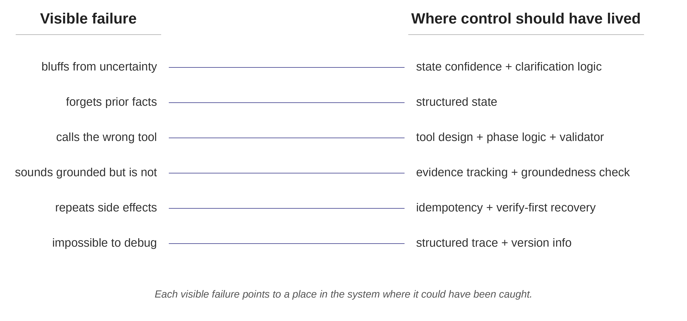



Most [AI agent](/posts/series/what-an-agent-actually-is/index.qmd) demos fail in boring ways.

The agent forgets something the user said five turns ago. It treats a guess as a fact. It calls the wrong tool because the tool name sounded close enough. It returns a polished answer only loosely connected to the evidence. It retries a calendar write after a timeout and books the same meeting twice. Then, when someone asks what happened, the logs say:

```python
tool_call: retrieval, status: success
```

Reliability becomes concrete after something breaks. The team needs to know why the agent believed a claim, why it called a tool, why it skipped a clarifying question, why it retried a write, and why the run cannot be reconstructed.

The usual instinct is to blame the model. A stronger model may help, but many agent failures come from the system around the model: state, workflow, tool contracts, gates, retry policy, retrieval design, traces, and evaluation.

The diagnostic question is simple: what failed, and where should control have lived?

That question starts harness engineering. This series is about building agent systems that survive real users, real tools, real ambiguity, and real debugging.

## Three small agents

This series uses three running examples.

- **Customer support intake agent:** holds a conversation with a user, gathers the issue, identifies what is known and uncertain, and produces a structured handoff for a human. It does not solve the issue or write to external systems.
- **Scheduling assistant:** books, reschedules, and cancels meetings. It uses tools that change the world.
- **Internal docs Q&A agent:** answers questions over company documentation. It retrieves passages and synthesizes a short response.

Six failure shapes show up across these agents.

## Failure 1: The agent bluffs when it should pause

A user opens the intake conversation: "We're having issues with the new dashboard, and I think it's related to the migration we did last month, but I'm not totally sure."

A weak agent starts triaging the migration. It asks about migration steps, surfaces likely root causes, and drafts a handoff that pins the issue to the migration.

The user never confirmed the migration as the cause. The agent treated a hedge as a fact.

A reliable agent should record the uncertainty and ask a clarifying question before building on the claim: "Has the migration been confirmed as the cause, or is that still a guess?"

The system needs a field for uncertainty:

```python
state["root_cause"] = {
    "value": "migration",
    "confidence": "uncertain",
    "source": "user_hedged_statement",
}
```

It also needs behavior tied to that label. If the next step depends on a fact labeled `uncertain`, the workflow should route to clarification instead of action.

- **Visible failure:** the agent jumped to conclusions.
- **Deeper failure:** the system had no mechanism for treating uncertainty differently from certainty.

## Failure 2: The agent forgets what already happened

In the same intake conversation, the user says on turn 2: "We're on the enterprise plan, and the dashboard is the only feature we use." On turn 9, the agent asks: "Just to confirm, are you on the standard or enterprise plan?" On turn 12, the handoff record lists the plan as `unknown`.

The system failed because it never stored the plan tier in state. It stuffed the transcript back into context every turn and relied on the model to keep the right facts active.

The fix is to store confirmed facts once:

```python
state["customer"] = {
    "plan_tier": {
        "value": "enterprise",
        "confidence": "confirmed",
        "source_turn": 2,
    },
    "primary_feature": {
        "value": "dashboard",
        "confidence": "confirmed",
        "source_turn": 2,
    },
}
```

Now the agent reads `plan_tier = enterprise` instead of rediscovering it from the transcript. The transcript records what the user said. State records what the system can rely on. [State, not transcript, is agent memory](/posts/series/the-agent-harness/03-state-not-transcript/index.qmd) goes deeper into that distinction.

- **Visible failure:** the model forgot.
- **Deeper failure:** the system treated the conversation transcript as memory.

## Failure 3: The agent takes the wrong action

The scheduling assistant has these tools:

```python
list_calendar_events()
find_event_by_description()
reschedule_event()
cancel_event()
```

The user says: "Move my Tuesday review with Priya to Thursday."

A weak agent calls `cancel_event` and creates a fresh booking. Or it calls `reschedule_event` with a fuzzy description, and the API matches the wrong event.

The safe sequence is explicit: find the event, disambiguate if multiple events match, then reschedule a specific event ID. The model should not invent that sequence from scratch every time.

The harness should make the wrong action hard to take. It can require an identified event ID before `reschedule_event`, require user confirmation when multiple events match, and block destructive actions unless the workflow phase allows them.

- **Visible failure:** the agent picked the wrong tool.
- **Deeper failure:** the system relied on the model to invent a safe tool sequence instead of encoding the sequence in the harness.

## Failure 4: The agent sounds grounded, but it is not

The docs Q&A agent receives this question: "What is our policy on customer data retention for trial accounts?"

It retrieves five passages and returns a confident answer saying 30 days. The corpus says 90 days. The right passage was in the retrieved set, but synthesis leaned on the wrong evidence.

A reliable retrieval agent should track supported claims explicitly. The system needs to know which claim came from which passage, and whether that passage addresses the question being asked.

```python
supported_claims = [
    {
        "claim": "Trial account data is retained for 90 days after trial expiry.",
        "evidence_refs": ["policy_42:trial_accounts"],
        "confidence": "confirmed",
    }
]
```

Synthesis should write from supported claims, not from a raw pile of passages.

- **Visible failure:** the agent gave a wrong answer.
- **Deeper failure:** the system never tracked which claims were supported by which evidence.

Groundedness is a system property. Polished prose does not make an answer grounded.

## Failure 5: The agent repeats a side effect

The scheduling assistant calls:

```python
reschedule_event(
    event_id="evt_482",
    new_time="2026-05-12T14:00",
)
```

The API takes thirty seconds and returns a timeout. The agent cannot tell whether the write succeeded, so it retries. Now Priya receives two confusing calendar updates.

Writes need different retry semantics from reads. Every write should carry an idempotency key:

```python
payload = {
    "event_id": "evt_482",
    "new_time": "2026-05-12T14:00",
    "idempotency_key": "run_847_step_3",
}
```

After an ambiguous timeout, the agent should check the calendar before retrying. Verify first, retry second.

- **Visible failure:** the meeting update happened twice.
- **Deeper failure:** the system treated reads and writes as equivalent tool calls.

## Failure 6: Nobody can debug it

A user reports that the docs Q&A agent gave a wrong answer about retention policy yesterday. The logs contain the user's question, the agent's response, and this line:

```python
tool_call: retrieval, status: success
```

That log cannot localize the failure. It does not show which passages were retrieved, which were ranked highest, what prompt version was deployed, what state the system had, or which answer claims came from which passage.

A useful trace records enough to debug the run: input, relevant state, action chosen, tool inputs and outputs, verification result, state after, prompt version, tool version, and model version. Without that trace, the team cannot tell whether the failure came from retrieval, synthesis, prompting, model behavior, or a recent deployment.

- **Visible failure:** the team cannot debug the answer.
- **Deeper failure:** the system logged steps instead of recording decisions.

[Traces are how agents get better](/posts/series/the-agent-harness/05-traces/index.qmd) goes deeper into useful traces.

## The pattern behind the failures

Each failure asks the model to carry control that should live in the harness.

The harness decides what the model sees, what actions are allowed, what gets verified, and what is preserved for debugging and improvement. The model still matters, but reliability depends on the control surfaces around it.

{#fig-failure-shapes fig-alt="A mapping diagram with six agent failure shapes listed on one side and the control surfaces in the surrounding system that should have caught them on the other, with lines connecting each failure to its responsible surface. Every line lands on a system-level control rather than on the model itself, visually making the point that these failures are fixed in the harness around the model, not in the model."}

The control surfaces are concrete:

- **State:** stores facts, uncertainty, workflow phase, and pending actions.
- **Workflow logic:** determines which step can happen next.
- **Tool contracts:** define safe inputs, outputs, side effects, and retry behavior.
- **Gates and validators:** block unsafe or unsupported actions.
- **Retrieval and evidence mapping:** connect answers to supporting sources.
- **Traces:** preserve enough information to debug and harden the system.
- **Regression tests:** keep known failures from returning.

The next four articles go deeper on the most important parts:

- [The harness is the product](/posts/series/the-agent-harness/02-harness-is-the-product/index.qmd): why an agent is the model plus the harness around it.
- [State, not transcript, is agent memory](/posts/series/the-agent-harness/03-state-not-transcript/index.qmd): how state gives the system memory it can read and update.
- [Prompts guide. Gates enforce](/posts/series/the-agent-harness/04-prompts-gate/index.qmd): how gates and tools limit actions, execute them safely, and verify outcomes.
- [Traces are how agents get better](/posts/series/the-agent-harness/05-traces/index.qmd): how traces support debugging, regression tests, and the hardening loop.

## Common mistakes

Teams usually get agent reliability wrong in predictable ways:

- **Model-only diagnosis:** when the agent fails, the team swaps in a stronger model instead of fixing the missing control surface.
- **Demo-as-evidence thinking:** a demo shows that a path can work, not that the system survives messy users, ambiguous inputs, tool errors, or repeated runs.
- **Prompt-only boundaries:** a system prompt that says "do not do XYZ" is guidance, not enforcement. Real boundaries live in gates, validators, permissions, and tool contracts.
- **Step logging:** logs that say what happened do not explain why it happened. A useful trace records state, decisions, tool inputs, tool outputs, verification results, and version information.
- **Random-failure framing:** most failures are recurring shapes. Once the category is visible, the team can engineer against it.

Reliable agents do not come from prompts alone. They come from moving the right responsibilities into the harness: state, workflow, gates, tools, verification, traces, and tests.