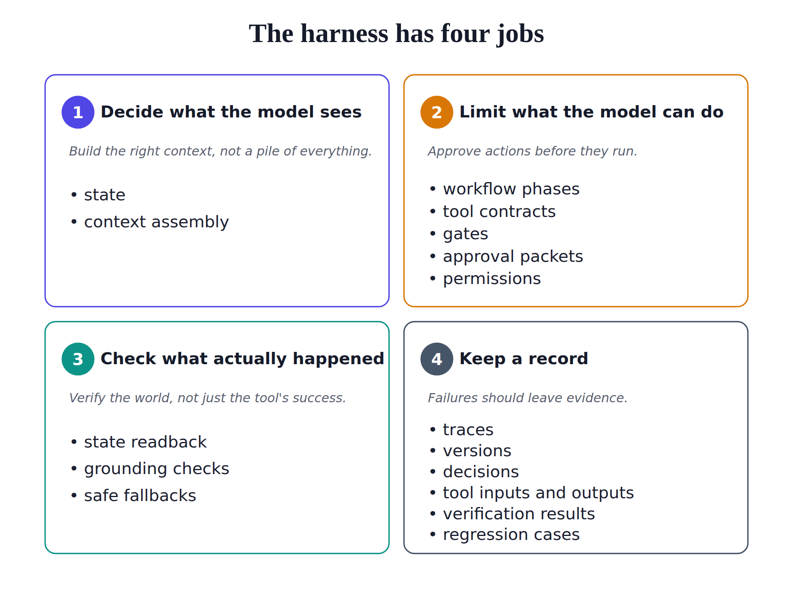
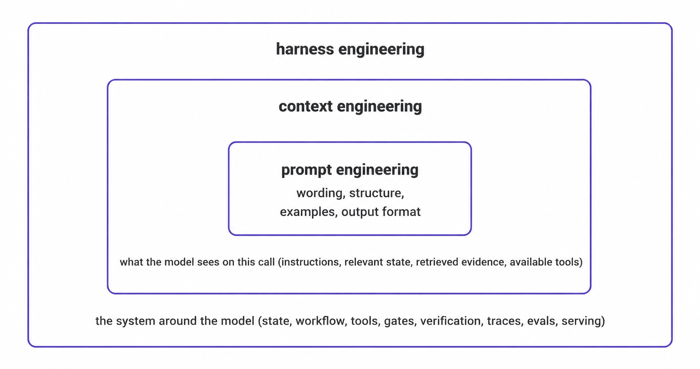



A stronger model does not automatically give you a reliable agent.

The [previous article](/posts/series/the-agent-harness/01-demos-break/index.qmd) catalogued six ways agent demos break in production. The intake agent forgot a fact the user gave it on turn 2. The scheduling assistant double-booked a meeting after an ambiguous timeout. The docs Q&A agent gave a confident, well-formed, wrong answer.

The instinct after each failure is to reach for a stronger model. Sometimes that helps a little. More often, the failure returns in a slightly different shape because the system around the model has not changed. The useful reframe is simple:

**Agent = model + harness**

The model is the reasoning engine. The harness is the system the model lives inside. Models get swapped, cheaper, and faster. The harness carries the team's accumulated understanding of how to make the agent reliable. For production agents, the harness is the product.

## Prompts guide. Harnesses constrain.

A prompt tells the model what behavior you want. A harness decides what behavior the system permits.

The difference is concrete:

- **Refunds:** a prompt can say, "Do not issue refunds." A harness can make the refund tool unavailable.
- **Scheduling:** a prompt can say, "Ask for clarification if the target meeting is ambiguous." A harness can reject `reschedule_event` unless state contains one confirmed event ID.
- **Docs Q&A:** a prompt can say, "Use only the retrieved documents." A harness can require every final claim to map to a cited passage.
- **Retries:** a prompt can say, "Be careful with retries." A harness can enforce one write attempt, require an idempotency key, and route ambiguous timeouts to verification.

The prompt shapes one model call. The harness controls the workflow around that call. It makes some failures impossible to commit and makes the rest easier to detect.

That is the shift from prompt engineering to harness engineering.

## Scope is the first harness decision

Before designing the harness, define the agent's job. Scope answers three questions:

1. What exact job does this agent do?
2. What artifact or outcome should exist when it succeeds?
3. What is it explicitly not allowed to do?

For the intake agent, a scoped version reads:

```markdown
A discovery-stage intake agent that conducts an initial conversation with a user reporting a support issue and produces a structured handoff for a human support agent. It may ask clarifying questions, retrieve approved account information, and summarize confirmed facts and open questions. It may not commit to remediation, issue credits or refunds, change account state, or attempt to resolve the issue itself.
```

## The harness has four jobs

{#fig-harness-jobs fig-alt="A two-by-two grid of four numbered cards describing the harness's four jobs. Card 1, Decide what the model sees: build the right context, not a pile of everything. Mechanisms: state, context assembly. Card 2, Limit what the model can do: approve actions before they run. Mechanisms: workflow phases, tool contracts, gates, approval packets, permissions. Card 3, Check what actually happened: verify the world, not just the tool's success. Mechanisms: state readback, grounding checks, safe fallbacks. Card 4, Keep a record: failures should leave evidence. Mechanisms: traces, versions, decisions, tool inputs and outputs, verification results, regression cases."}

Once scope is clear, the harness has four jobs:

- **Shape the input:** decide what the model sees at each step. The model should receive the relevant state, retrieved evidence, available tools, and local instruction, not a pile of every transcript turn and document.
- **Bound the action:** decide what the model is allowed to do. The model can propose an action, but workflow phases, tool contracts, gates, approval packets, and permissions decide whether it runs.
- **Verify the outcome:** check what actually happened. A tool returning `success` does not prove the world is correct. A rescheduled meeting needs calendar readback. A grounded answer needs claim-to-evidence checks.
- **Preserve the evidence:** record enough information to debug and improve the system. Useful traces include input, state, action, tool inputs and outputs, verification results, state after, and version information.

A reliable agent takes bounded actions, fails safely when it cannot proceed, leaves enough evidence to debug the run, and becomes harder to break after each incident.

## Prompt, context, and harness engineering

Prompt, context, and harness engineering solve different problems.

{#fig-nested-levels fig-alt="Three concentric nested boxes or rings showing levels of engineering. The innermost level is prompt engineering, enclosed by a larger level for context engineering, enclosed by the outermost level for the harness. The nesting shows each level containing the one inside it: a good harness contains good context engineering, which contains good prompts."}

- **Prompt engineering:** writes the instructions for one model call: wording, structure, examples, and output format.
- **Context engineering:** decides what enters the model context at each step: system instructions, relevant state, retrieved passages, memory, available tools, and local task framing.
- **Harness engineering:** controls the application around the model: when context is assembled, which tools are available, which actions are allowed, how writes are verified, how state persists, how failures recover, how traces are written, and how regression cases catch old failures.

Putting the failure at the right level saves wasted iteration. A bad instruction may need a prompt change. Missing evidence may need context changes. Unsafe actions, duplicate writes, missing state, weak verification, and thin traces need harness changes.

## This is not a call for overengineering

A harness matters, but teams can build too much harness too early. The minimum useful harness depends on the agent's scope.

- **Intake agent:** clear scope, structured state with confidence labels, a few workflow phases, no write tools, a basic handoff artifact, step traces, and a small regression set.
- **Scheduling assistant:** target identification, narrow write tools with idempotency, one-attempt write policy, read-after-write verification, and traces of tool inputs and outputs.
- **Docs Q&A agent:** retrieval provenance, claim-to-evidence mapping, a "no supported answer" behavior for thin evidence, auth-aware retrieval, and traceable citations.

Build the harness around the risks created by the job. An intake agent without write authority does not need the same side-effect controls as a scheduling assistant. A docs Q&A agent does need evidence mapping because its main risk is confident unsupported synthesis.

## Which parts of the harness age?

Some harness pieces get lighter as models improve. Tool-selection scaffolding matters less when models choose tools reliably. Format validators matter less when structured output becomes dependable. Long prompt chains matter less when models handle more reasoning in one call. These pieces compensate for model limitations, so stronger models reduce their importance.

Other harness pieces remain necessary because they control product risk. A smarter model still cannot unsend a calendar invite, undo a payment, or reconstruct last month's behavior without traces. It still needs runtime boundaries around tools, writes, permissions, and user-visible actions.

The pieces that age are scaffolding around weak model behavior. The pieces that stay are tied to reliability: state, tool contracts, gates, verification, recovery, traces, and tests.