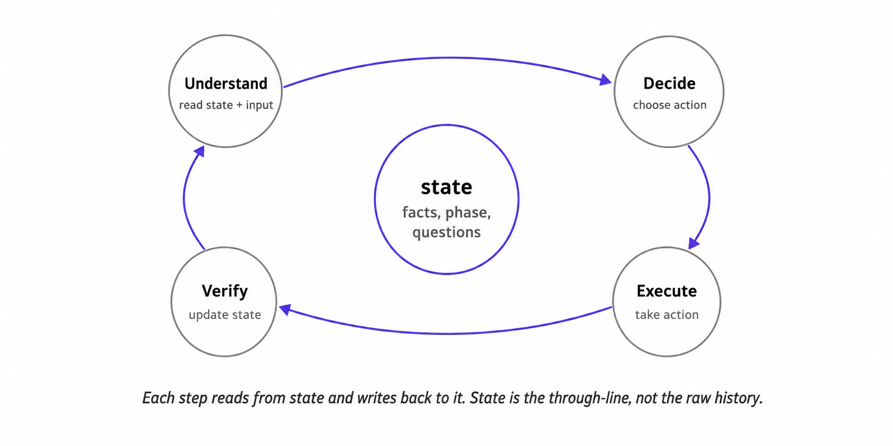



One of the easiest ways to build a flaky agent is to treat the conversation transcript as memory. It feels reasonable: the whole conversation is right there, the user said what they needed, the model can read the previous turns. Why not just pass the chat history back into the model and let it remember? It works in demos. It breaks in production.

The intake agent makes the failure concrete. On turn 2 of a conversation, the user said: *"We're on the enterprise plan, and the dashboard is the only feature we use."* On turn 9, the agent asked: *"Just to confirm, are you on the standard or enterprise plan?"* On turn 12, the handoff record went out with `plan_tier: unknown`. The user is annoyed. The team's first instinct is to blame the model. Surely a stronger one would have remembered. Maybe a longer context window. Maybe a system prompt that explicitly said "do not forget user-provided information." None of those are wrong, but none of them is the actual fix. The actual fix is structural. The agent forgot because the system never told it what to remember. The transcript was full. The agent's memory was empty.

Transcript-as-memory is the most visible version of this problem, but the same shape shows up wherever a system asks raw history to do the job that structured state should be doing. The docs Q&A agent does it with retrieved passages. The scheduling assistant does it with tool-call history. In every case, the system is asking raw material to carry structure it doesn't have.

The move worth keeping:

**Raw history is what came in. State is what the system relies on.**

The previous article made the case that the harness is the product. State is the first concrete component of that harness. If the harness is the system the model lives inside, state is what that system knows.

## Why raw history is fragile

Raw history is noisy. Conversations contain hedges, corrections, side topics, and vague references. Retrieved passages may overlap or contradict. Tool histories include failed calls, ambiguous returns, and side effects that may or may not have completed. Asking the model to reinterpret all of that every step is where drift begins.

Raw history also lacks belief status. *“I think it might be the migration”* and *“Our logs confirm the migration caused it”* are both just text. They should produce different system beliefs, but raw history does not mark the difference.

Raw history hides what is missing. A conversation can sound productive while still missing a required handoff field. A passage set can cover the topic without answering the exact question. What looks like model forgetfulness is often missing state: the system never gave the model a stable thing to remember from.

## What state is

To make state concrete, start with the job it performs. A useful state object should answer five questions on every step.

### What state needs to answer

1. What do we currently believe?
2. How sure are we?
3. What remains unclear?
4. What stage of the workflow are we in?
5. What already happened, and what should happen next?

These questions force a functional view of state. State isn't a schema; it's the thing that answers these questions for the system. If a state field doesn't help answer one of these questions, it probably doesn't belong in state. If a question can't be answered from state, the state design is incomplete.

The five questions are stable across agent types. The shape of the answers is not.

### A simple state object

For the intake agent, a minimal state object answers the five questions like this:

```python
state = {
    "facts": {
        "plan_tier": {"value": "enterprise", "confidence": "confirmed"},
        "root_cause": {"value": "migration", "confidence": "uncertain"},
    },
    "open_questions": ["Has the migration been confirmed as the cause?"],
    "workflow_phase": "discovery",
    "ready_for_handoff": False,
}
```

The shape is deliberately mundane. There's no clever data structure. The point isn't that state is sophisticated. The point is that state is *explicit*. When the agent decides whether to ask about the plan tier, it reads `facts["plan_tier"]["confidence"]`. When the agent decides whether it's allowed to draft a summary, it reads `ready_for_handoff`. Those decisions are no longer scattered across whatever the model happens to remember on a given step. They are local reads against a known schema.

### State versus raw history versus trace

It helps to separate three things that often get blurred. They overlap, but they are not the same.

**Raw history** is what came in. Conversation transcripts, retrieved passage sets, tool-call histories, user uploads. Raw history preserves language, tone, and provenance. Its job is to be a faithful record of inputs.

**State** is what the system relies on *now*. Confirmed and uncertain facts. Open questions. Workflow phase. Proposed actions. State's job is to guide behavior on the next step.

**Trace** is what happened during the run. Input, state before, action chosen, tool inputs and outputs, verification result, state after, version info. Trace's job is to support debugging and hardening after the fact. Article 5 covers this in depth.

The three artifacts apply to all three running agents, even though their contents look different:

| | Raw history | State | Trace |
|---|---|---|---|
| **Intake agent** | Conversation transcript | Confirmed and uncertain facts, open questions, handoff readiness | Which facts were extracted, which questions were asked, how the handoff was produced |
| **Scheduling assistant** | User request, calendar search results, tool outputs | Candidates, selected target, proposed change, approval, write attempts, verification | Which event was selected, what was approved, what was written, whether verification passed |
| **Docs Q&A agent** | Query, retrieved passages, draft answer | Retrieved refs, grounded claims, evidence mapping, validation status | What was retrieved, what entered context, which claims were supported, which checks fired |

Raw history, state, and trace exist in every agent. What changes from agent to agent is the shape of the state in the middle.

### Three state shapes for three jobs

The differences in the state column aren't incidental. They reflect what each agent is *for*.

**Discovery state (intake agent).** Discovery state's job is to keep the agent from re-asking what it already knows or summarizing what is still uncertain. A discovery state without confidence labels is functionally indistinguishable from a bag of strings.

**Action state (scheduling assistant).** Action state's job is to make sure the agent never writes to the world without first establishing, and recording, exactly what it's going to do. The proposed change is materialized before approval or execution. If approval comes back, the runtime executes that object, not a fresh model-generated version of the action.

```python
state = {
    "phase": "verify_safe_to_change",
    "user_request": "move my Tuesday 2pm with Priya to Wednesday 10am",
    "candidates": [
        {"event_id": "evt_8819", "title": "1:1 with Priya",
         "start": "2026-05-12T14:00", "is_recurring": False,
         "match_confidence": "confirmed"},
    ],
    "proposed_change": {
        "kind": "reschedule",
        "target_event_id": "evt_8819",
        "new_start": "2026-05-13T10:00",
        "idempotency_key": "run_204:evt_8819:reschedule:2026-05-13T10:00",
    },
    "approval": None,
    "verifications": [],
    "write_attempts": 0,
}
```

**Evidence state (docs Q&A agent).** Evidence state's job is to keep synthesis from outrunning the evidence. The system cannot produce a confident claim without a passage to back it.

```python
state = {
    "phase": "validate",
    "query": "What is the retention policy for trial accounts?",
    "retrieved_passages": [
        {"id": "psg_1102", "category": "trial_accounts", "rank": 1, "score": 0.93},
        {"id": "psg_0871", "category": "standard_accounts", "rank": 2, "score": 0.91},
    ],
    "claims": [
        {
            "text": "Trial account data is retained for 90 days after trial expiry.",
            "evidence": ["psg_1102"],
            "confidence": "confirmed",
        },
    ],
    "drafted_answer": "Trial account data is retained for 90 days...",
    "validation": {"all_claims_cited": True, "category_match": True},
}
```

The three state shapes look different because they're solving different problems. The underlying discipline is the same: take what the system needs to remember to make its next decision well, give it a name, give it a structure, and read from that structure instead of asking the model to reconstruct it from text.

## How state represents uncertainty

A state field should not only record what the system thinks. It should also record how safely the system can rely on it.

A bare value silently acts as if it were confirmed:

```python
state["root_cause"] = "migration"
```

A labeled value tells the harness how to behave:

```python
state["root_cause"] = {"value": "migration", "confidence": "uncertain"}
```

The exact labels don't matter. The important point is that state should tell the harness how to behave on each value.

### Confidence labels

Five labels cover most of what production agents need:

| Label | Meaning | Harness behavior |
|---|---|---|
| `confirmed` | Safe to rely on | Use it, summarize it, act on it if other gates pass |
| `uncertain` | Plausible but not safe yet | Ask, verify, or avoid treating it as fact |
| `needs_verification` | Requires a specific check | Run the lookup, validator, or read-after-write step |
| `stale` | Was confirmed once but may no longer be true | Refresh before relying on it |
| `contradicted` | Conflicting evidence exists | Preserve both sides and resolve before acting |

The labels apply across agent types, with different weight. Discovery state leans on `confirmed` and `uncertain`. Action state uses `match_confidence` on candidates and `needs_verification` on writes. Evidence state uses `confirmed` on supported claims and `contradicted` when passages disagree on the same point.

### Contradictions are a label, not an overwrite

The most dangerous state update is silent overwrite. The system sees a new value, replaces the old one, and loses the fact that the two may conflict.

Turn 3: *"We don't have internal logs for this system."*
Turn 10: *"The application logs show the migration completed successfully."*

A weak updater does this:

```python
state["facts"]["logging"] = "application_logs_available"
```

That loses the important part: the two claims may not mean the same thing, or one may be wrong. The system should not silently pick one and proceed.

A better update preserves the conflict as a first-class entry:

```python
state["facts"]["logging"] = {
    "value": None,
    "confidence": "contradicted",
    "conflicting_evidence": [
        {"source_turn": 3, "claim": "no internal logs for this system"},
        {"source_turn": 10, "claim": "application logs show migration completed"},
    ],
}
```

Now the next step is structurally constrained. Don't summarize confidently about logging. Don't diagnose based on either statement. Ask: *"Earlier you mentioned there were no internal logs, but you just mentioned application logs showing the migration completed. Are those different logging systems?"*

Contradictions are not noise. They are signal that the system should pause before acting. The same principle applies in scheduling (two candidate events with conflicting attributes) and docs Q&A (two retrieved passages disagreeing on the same point). The mechanism is the same in all three cases: mark the conflict, keep both sides, surface it on the next decision.

## How state gets used

State on its own is a data structure. What makes it useful is the discipline that reads and writes it, and the runtime checks that depend on it.

### Each step reads and writes state

Every meaningful step in an agent workflow does some version of this:

1. **Understand.** Read the relevant state. Read the new input. Update facts where the input is unambiguous. Mark new uncertainty.
2. **Decide.** Choose the next action: clarifying question, tool call, summary, handoff, refusal. Use state, not raw history, as the basis for the choice.
3. **Execute.** Take the action. If a tool was called, capture inputs and outputs. If a write happened, record the verification step.
4. **Verify.** Check that the action did what it was supposed to. Update state with what's now known. Mark anything that didn't go as expected.

In conversation, this loop runs per user turn. In a scheduling workflow, it runs across target identification, approval, execution, and verification. In a docs Q&A workflow, it runs across retrieval, grounding, synthesis, and validation. The vocabulary varies. The four-step rhythm doesn't.

The loop is what keeps state honest. Without it, state can drift in either direction: facts can sit unread because the agent forgot to consult them, or facts can be silently overwritten because the agent didn't pause to check whether the new claim contradicted an existing one. With the loop, every step is structured around the question: *what does the system know now, what does it want to do, what did it do, and what does it know after?*

{#fig-state-loop fig-alt="A four-step loop drawn around a central state store. The steps run in sequence, with the Understand step shown reading from the central state and the Verify step shown writing back to it, so state persists across iterations. A label notes that the steps may be conversation turns, workflow phases, or pipeline stages, while state remains the through-line connecting them."}

### State is what gates read from

The next article in this series is about gates: runtime checks that decide whether a proposed action gets through. State is what most gates check against.

A gate that says "do not reschedule until the target event is confirmed" needs a place to read target confirmation from. A gate that says "do not summarize uncertain root causes as facts" needs confidence labels. A gate that says "do not retry a write after ambiguous timeout" needs side-effect status. Without state, these are vague prompt instructions. With state, they are runtime checks:

```python
if action == "reschedule_event":
    assert state["proposed_change"] is not None
    assert state["candidates"][0]["match_confidence"] == "confirmed"
    assert state["write_attempts"] < state["write_attempts_budget"]
```

State is more than memory. It is what runtime control reads from before the system acts.

## What people get wrong

1. **Treating state as optional.**
   The most common failure is having no operational state at all. Raw history becomes the state, and the model has to reconstruct reality every step. State is not an optimization. It is the difference between an agent that knows what it knows and one that keeps re-deriving facts from raw text.

2. **Putting too much in state.**
   The opposite mistake is treating state as a giant cache: every utterance, passage, and model output gets persisted. State that holds everything holds nothing. The test is simple: *will the system behave worse later if this only lives in raw history or trace?* If yes, put it in state. If no, leave it out.

3. **Letting state drift from reality.**
   State is a model of the world, and models can be wrong. The scheduling state may say a meeting moved to Wednesday at 10; the calendar may say otherwise. Verification is what keeps state honest, which is what the Verify step in the loop is for.

4. **Storing values without confidence labels.**
   A bare value quietly acts confirmed, whether or not it should. State needs labels like `confirmed`, `uncertain`, `needs_verification`, `stale`, or `contradicted` so the harness knows how safely it can rely on each field.

5. **Silently resolving contradictions.**
   When evidence conflicts, the easy move is to pick one value and proceed. The reliable move is to preserve the contradiction and surface it on the next decision. Contradictions are signal, not noise.

The next article is about what happens when an agent acts on its state. State holds the system's beliefs. Gates and tool contracts are how the system makes sure those beliefs translate into safe action. Prompts can guide the model toward right action. But only the runtime, reading from state and enforcing real boundaries, can prevent the wrong one.

## References

- Anthropic. "Building Effective Agents." December 2024. <https://www.anthropic.com/engineering/building-effective-agents>
- Anthropic. "Effective Context Engineering for AI Agents." 2025. <https://www.anthropic.com/engineering/effective-context-engineering-for-ai-agents>
- Boeckeler, Birgitta. "The Engineering of AI Agents: Context, Harnessing, and Autonomy." InfoQ, May 2026. <https://www.youtube.com/watch?v=_R83pFpUWyM>
- Iusztin, Paul. "Agentic Harness Engineering." Decoding AI, 2025. <https://www.decodingai.com/p/agentic-harness-engineering>
