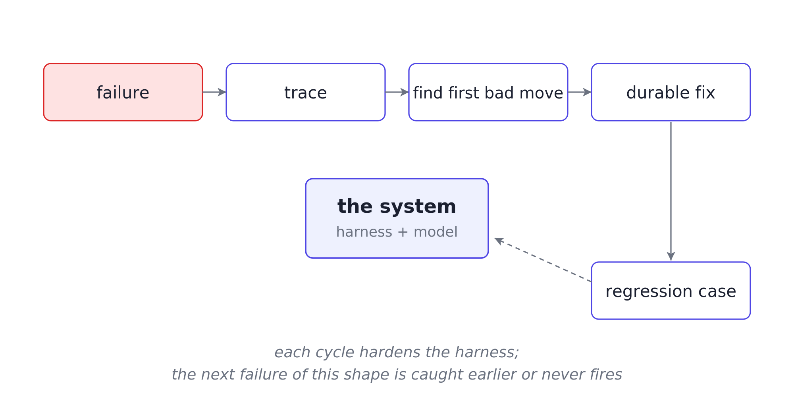



A user asked the docs Q&A agent: "What's the data retention policy for trial accounts?"

The agent answered: "Trial accounts: data is retained for 30 days after closure, after which it is deleted." The answer was confident, polished, and wrong. The corpus says trial-account data is retained for 90 days. Thirty days is the standard-account window.

The team finds out a day later, when the user files a correction. The logs show this:

```text
2026-05-08 14:23:18  run_551  query received
2026-05-08 14:23:19  run_551  tool_call: retrieval, status: success
2026-05-08 14:23:21  run_551  response generated
2026-05-08 14:23:21  run_551  run completed
```

That log records events. It does not show which passages were retrieved, what the model saw, why it chose 30 days, which passage supported the claim, or which validation checks ran. The team can guess but cannot debug.

Logs record what happened; traces show why.

The [previous article](/posts/series/the-agent-harness/04-prompts-gate/index.qmd) covered gates: runtime checks that stop wrong actions before they happen. This article covers traces: structured records that make failures explainable after they happen.

## What a useful trace records

A trace records one structured step for each meaningful action: a model decision, tool call, verification, phase transition, or gate firing. It should not store a wall of chat text or a dump of model reasoning.

Each step should record:

- **Versions:** prompt, model, tool, index, schema, and validator versions.
- **State before:** what the system knew before the step.
- **Context pack:** what the model actually saw.
- **Action chosen:** what the system decided to do, with a short reason.
- **Verification:** what was checked after the action.
- **State after:** what changed.

Here is one step from the failed retention run, captured at synthesis:

```python
trace_step = {
    "step_kind": "synthesize",
    "versions": {
        "prompt": "syn_v6",
        "index": "ri_v3",
        "validator": "val_v4",
    },

    "state_before": {
        "phase": "synthesize",
        "query": "What is the data retention policy for trial accounts?",
        "retrieved_passages": [
            {"id": "psg_1102", "category": "trial_accounts"},
            {"id": "psg_0871", "category": "general"},
            {"id": "psg_0883", "category": "general"},
            {"id": "psg_0902", "category": "general"},
            {"id": "psg_0915", "category": "general"},
        ],
    },

    "context_pack": {
        "retrieved_refs": ["psg_1102", "psg_0871", "psg_0883", "psg_0902", "psg_0915"],
        "passage_metadata_included": False,
    },

    "action_chosen": {
        "type": "draft_grounded_answer",
        "reason": "5 passages retrieved; drafting answer from passage content",
    },

    "verification": {
        "all_claims_cited": True,
        "category_alignment_check": "not_run",
    },

    "state_after": {
        "phase": "validate",
        "claims": [
            {
                "text": "Trial accounts: data retained 30 days after closure",
                "evidence": ["psg_0871"],
            },
        ],
        "drafted_answer": "Trial accounts: data is retained for 30 days after closure...",
    },
}
```

That is enough to debug the run. `general` account passages mentioning "30 days" entered the answer path, and no `category_alignment_check` caught the category mismatch.

### Rationale, not chain-of-thought

Store decision rationale, not full chain-of-thought. The rationale should be a short operational reason, captured in `action_chosen.reason`.

Examples:

- **Clarification:** target was ambiguous, so the agent asked a clarifying question.
- **Synthesis:** five passages were retrieved, so the agent drafted from passage content.

The team needs the reason for the action, not the model's internal rumination.

## Walking the retention-policy trace

The user asked about trial-account retention. The agent answered 30 days. The corpus says 90 days. The team opens `run_551`.

Step 1, `receive_query`, captured the user's message and wrote it into state.

Step 2, `retrieve`, pulled five passages:

```python
retrieved_passages = [
    {"id": "psg_1102", "category": "trial_accounts", "score": 0.93,
     "snippet": "Trial accounts: data retained 90 days after trial expiry."},
    {"id": "psg_0871", "category": "general", "score": 0.91,
     "snippet": "Standard accounts: data retained 30 days after closure..."},
    {"id": "psg_0883", "category": "general", "score": 0.89,
     "snippet": "Default retention windows for closed accounts are 30 days..."},
    {"id": "psg_0902", "category": "general", "score": 0.87,
     "snippet": "After account closure, customer data is purged within 30 days..."},
    {"id": "psg_0915", "category": "general", "score": 0.85,
     "snippet": "Standard data retention: 30 days post-closure..."},
]
```

Retrieval found the right passage and ranked it first.

Step 3, `synthesize`, shows the first bad move. Synthesis received passage text without category tags. It saw four general passages saying 30 days and one trial-account passage saying 90 days. Without category metadata, the model had no signal that the 90-day passage was the relevant one.

Step 4, `ground`, mapped the drafted claim to `psg_0871`. Grounding succeeded narrowly because the claim had a citation. The missing check was category alignment. The trace shows `category_alignment_check: not_run`.

The failure is now specific: retrieval found the answer, context assembly dropped the metadata, synthesis chose the wrong passage, and validation missed the category mismatch.

Reading only the output, a team might edit the synthesis prompt; reading the trace, it fixes the right layer: include category metadata in the context pack, weight category-specific passages for category-specific queries, and validate category alignment before returning the answer.

## From first bad move to durable fix

A failure should leave behind a trace, a fix, and a regression case.

- **First bad move:** locate where the run first went wrong. The trace should show whether the failure began in retrieval, context assembly, action choice, tool arguments, state updates, validation, or workflow phase.
- **Durable fix:** change the harness layer that failed. For the retention issue, that means category-aware retrieval, category metadata in the context pack, and category-alignment validation.
- **Regression case:** encode the failure shape so it cannot return silently. A "retention policy for [category]" query should retrieve the category-specific passage at rank 1, and the validator should reject answers citing the wrong category.

{#fig-hardening-loop fig-alt="A closed feedback loop with four stages. A failure produces a trace; the trace is read to identify the first bad move; the team ships a durable fix to the harness plus a regression test case; the fix and case feed back into the system, where they prevent that failure on future runs. An annotation marks the harness as the part that changes each cycle, so the improvements accumulate over time."}

Running this loop on every incident is reliability engineering; stopping at "patched the prompt, moved on" only manages symptoms. A system improves when the team stops wasting failure.

## Minimum viable trace

A v1 agent does not need a perfect observability platform. It needs a minimum viable trace.

For every meaningful step, record:

- **Identity:** `run_id`, `step_id`, and step kind.
- **Versions:** prompt, model, tool, index, validator, and schema versions.
- **State:** `state_before` and `state_after`.
- **Context:** what entered the model context.
- **Action:** `action_chosen` and a short reason.
- **Tool data:** tool inputs and outputs, when a tool runs.
- **Verification:** checks that ran and their results.
- **Metrics:** latency, cost, token counts, and other operational fields.

Different agents need different trace fields. For instance, these fields are useful for the **Docs Q&A agent:**
```text
retrieval query, passage IDs, claims, claim-to-evidence mapping, validator result
```

## Closing the loop

Five articles in this series, one argument:

- [Why AI agent demos break in production](/posts/series/the-agent-harness/01-demos-break/index.qmd): recurring production failures live in the system around the model.
- [The harness is the product](/posts/series/the-agent-harness/02-harness-is-the-product/index.qmd): an agent is the model plus the harness around it.
- [State, not transcript, is agent memory](/posts/series/the-agent-harness/03-state-not-transcript/index.qmd): state is the memory layer the runtime can read and update.
- [Prompts guide. Gates enforce](/posts/series/the-agent-harness/04-prompts-gate/index.qmd): gates turn state into runtime enforcement.
- Traces are how agents get better: traces turn failures into durable fixes.

The harness has four jobs:

- **Shape the input:** decide what the model sees.
- **Bound the action:** decide what the system allows.
- **Verify the outcome:** check what happened.
- **Preserve the lesson:** keep enough evidence to improve the system.

State tells the system what it believes. Gates decide what it may do. Tools let it act. Verification checks the result. Traces preserve the path.
