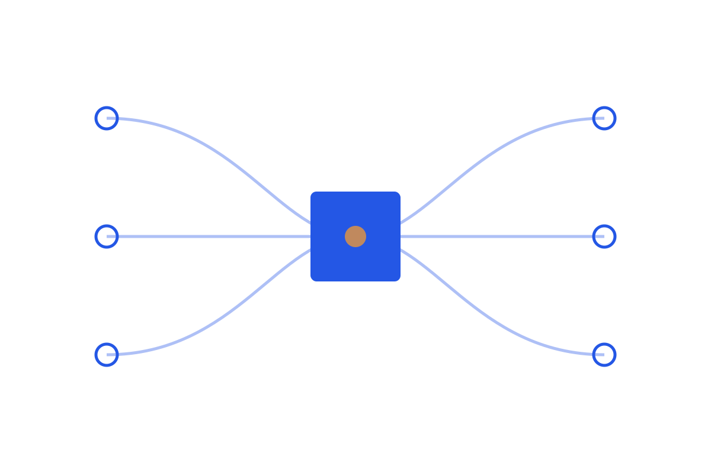

```{=html}

```

A demo agent and a production agent run the same model. The difference is everything around it: how state is carried, where the run is gated, what gets traced, how output is verified before it is trusted. This series argues that this scaffolding, the harness, is usually where reliability is won or lost.

Read in order:
