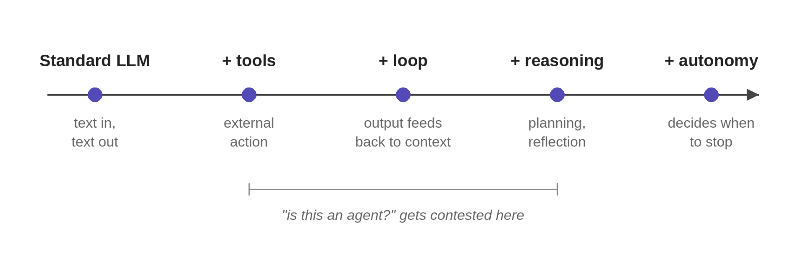



"Agent" has become the most overloaded word in AI engineering. Vendors apply it to everything from a single tool-use LLM call to systems that run autonomously for days. The definitions in serious use don't agree with each other, and the disagreement isn't going to resolve.

The right move isn't to pick a winner. It's to refuse the question. Stop asking whether something is an agent. Ask how much autonomy it has, and whether that's the right amount for the task.

## Stop asking for one definition

The definitions across the field vary, and the variation is real:

- **Anthropic** [@anthropic_2024_agents] draws a sharp architectural line: *workflows* are systems where LLMs and tools run through predefined code paths; *agents* are systems where the LLM dynamically directs its own process and tool use. Under that definition, many production "agents" are better described as workflows.

- **Chip Huyen** [@huyen_2025_agents] uses the classical AI definition: an agent is anything that perceives its environment and acts on it. By that standard, ChatGPT is an agent, and so is a RAG system: its retrievers and SQL executor are the tools through which it perceives and acts on its environment.

- **Nathan Lambert** [@lambert_2024] treats tool-use language models as the starting point of the agent spectrum, with complexity increasing from there.

- **Cameron Wolfe** [@wolfe_2025] builds the idea from first principles: standard LLMs, tool usage, decomposing problems, reasoning models, and more autonomous systems. He frames agents as lying on a spectrum of capabilities rather than drawing one hard threshold for what counts as a "real" agent.

- **McKinsey’s 2025 enterprise survey** [@mckinsey_2025] frames AI agents as systems based on foundation models that act in the real world and are capable of autonomously planning and executing multiple steps in a workflow. This is a more autonomy-heavy enterprise framing than Lambert’s tool-use baseline.

These definitions do not fully agree. That is why the better question is not "is this an agent?" but "how much autonomy does it have, and is that the right amount for the task?"

## The autonomy spectrum

The cleanest way to understand what an agent is is to start with what it isn't, and add one capability at a time.

| Stage | What it adds |
|---|---|
| **Standard LLM** | Text in, text out. Access to the world is limited to training data and the prompt. |
| **+ Tools** | The model emits structured calls routed to external systems: search, databases, code execution, APIs. |
| **+ Loop** | Tool output feeds back into context, and the model decides what to do next. Control flow stops being linear. |
| **+ Reasoning** | The model plans before acting, evaluates partial results, and revises when something fails. |
| **+ Autonomy** | The model decides when to stop. Open-ended tasks, no predefined path, runs that may last minutes or hours. |

A few of these stages deserve more than a row.

**+ Tools** is the first place the word "agent" gets applied, and where the definition fight starts. A model that emits one tool call and synthesizes the result is doing more than text generation, but calling it autonomous is a stretch. Wolfe calls this Level 1; Lambert calls it the entry point to the spectrum.

**+ Loop** is where "agentic" becomes a defensible label. The model can chain operations: search, read a result, refine the query, search again, synthesize. ReAct [@yao_etal_2023] formalized this early (alternating reasoning and action steps until the model decides it's done) and it's still the canonical pattern. The loop is also where [things fail in interesting ways](/posts/series/the-agent-harness/01-demos-break/index.qmd): the model can loop without converging, hallucinate tool calls, or decide the task is done when it isn't.

**+ Autonomy** is the regime Anthropic reserves the word "agent" for, and it's where the failure modes get expensive.

Each step adds capability and removes a constraint. Each one is also a deliberate engineering choice. More autonomy isn't better; it's different. A task that would be well served by a fixed workflow doesn't improve when you add a planning loop, and a task that genuinely needs open-ended exploration isn't solved by a single tool call.

To make this concrete, take a customer-support refund task. A standard LLM can't handle it at all. With no access to the order record, the best it can do is draft a generic reply that pretends to. With tools, it can look up the order and draft a real one. With a loop, it can ask for missing information and retry. With reasoning, it can handle edge cases: orders past the policy window, partial refunds, conflicts with prior tickets. With autonomy, it decides whether to issue the refund or escalate.

{#fig-agent-spectrum fig-alt="A horizontal spectrum diagram for the word agent. The left end is labeled with a single tool call, the simplest case. Moving right, the points increase in autonomy and scope through multi-step tool use and longer task loops. The right end is labeled with systems that run without human input for extended periods. The figure frames agent as this whole range rather than one fixed point on it."}

## What agents are built from

Strip away the marketing and the architecture is consistent across the spectrum. Every agent, from a single tool-use call to a long-running autonomous system, is built from the same primitives:

- **Model.** Decides what to do next.
- **Tools.** Let the model act on the world.
- **Loop.** Runs the model repeatedly, feeding outputs back as context.
- **Memory.** What's available across loop iterations and across sessions.
- **Control flow.** Decides which path through the system gets taken; via explicit code, or implicit in the model's reasoning.

The proportions and complexity vary; the components don't.

This is also why agents aren't a fundamentally new paradigm. A modern agent is a tool-use LLM in a loop with structured control flow, and each component has been around for years: Toolformer [@schick_etal_2023] for tool use, ReAct [@yao_etal_2023] for the reasoning-and-action loop, and the broader control-flow patterns Anthropic documented in late 2024. The novelty isn't the architecture. It's that the underlying language models are finally good enough at instruction-following, structured output, and reasoning that the architecture works in production.

Frameworks like LangChain, LangGraph, and the OpenAI Agents SDK abstract these primitives into higher-level constructs. That's often useful, as they handle schema generation, message management, tool dispatch, retry logic. But the abstraction has a cost. Anthropic's recommendation is worth taking seriously: start with direct API calls so you understand the mechanics, then reach for frameworks once the cost of not using one is clear. The [next article](/posts/series/what-an-agent-actually-is/02-agent-frameworks/index.qmd) goes deep and looks at what tool calls look like at the token level, how the loop is implemented, and what frameworks save you versus what they hide.

## More autonomy is not always better

If you read AI marketing in 2026, the implicit definition of an agent is the right end of the spectrum: a system that operates without human input, makes decisions, takes actions, plans across long horizons. That's the picture. It's also a small slice of what's actually deployed.

Anthropic's engineering team has been direct about this. Their observation, after working with dozens of teams building production systems: the most successful implementations weren't using complex frameworks or specialized libraries. They were building with simple, composable patterns. The systems delivering value in production are mostly workflows with LLM calls in them, not open-ended autonomous agents.

Two systems I've built sit at different points on the spectrum. The clinical-documentation pipeline is a workflow: code routes a series of LLM calls that [extract problems, labs, and physical-exam findings into note sections](/posts/series/research-foundations-of-modern-llms/05-information-extraction/index.qmd). The LLM is the labor; the control flow is fixed, and that's what makes the system shippable. The deep research agent I built sits further right. Query formulation, how deeply to read each source, and when to stop are all the model's calls, with a controller-enforced budget on top so the agency stays bounded.

This isn't a temporary state that resolves when the models get better. It reflects a permanent engineering reality: predictability is valuable. A workflow with fixed control flow is easier to debug, evaluate, and ship. An autonomous agent that decides its own path is harder on every axis. For most production tasks, the cost of that flexibility has to be balanced against its benefit. McKinsey's 2025 survey found only about 10% of enterprises have agents running in production in even a single department, despite vendor messaging suggesting far wider adoption.

So insisting that only the autonomous end of the spectrum counts as an agent is a category error. It defines the word by the marketing extreme rather than by what the systems actually do. The question that informs design decisions isn't *is this an agent?* It's *how much autonomy does this have, and is that the right amount for the task?*