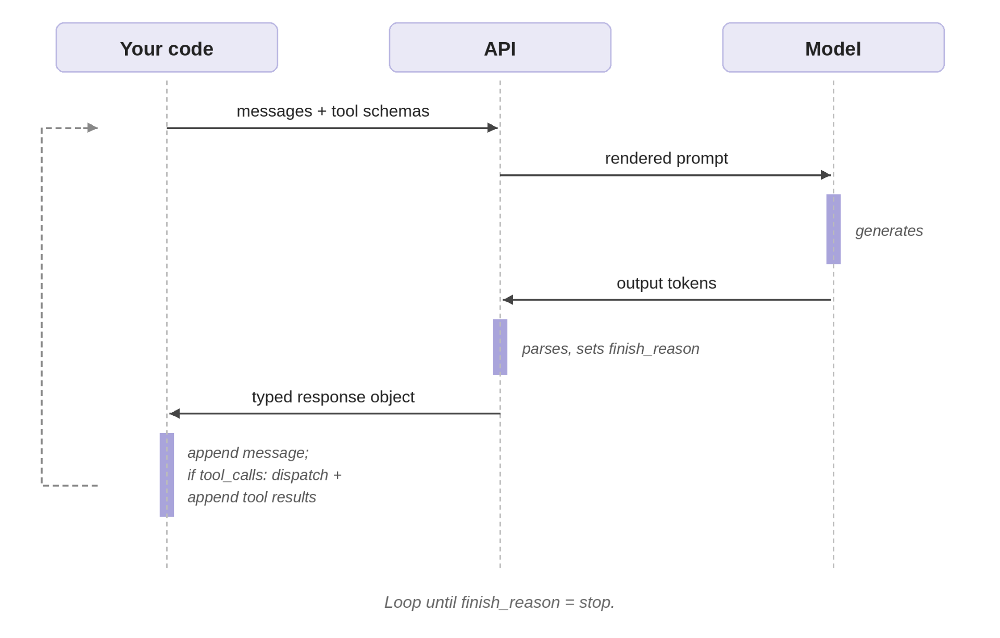



[The first article](#) treated "agent" as a region on a spectrum. This one goes inside one specific point on that spectrum, the loop-with-tools agent, and shows what's actually happening when you call `Runner.run(agent, message)` or its equivalent.

Frameworks like the OpenAI Agents SDK, LangChain, and LangGraph hide a lot of mechanics behind clean abstractions. That's mostly a good thing. But when an agent misbehaves, calls the wrong tool, loops forever, returns garbage, the abstractions stop helping and the underlying mechanics start mattering. Debugging at that point requires distinguishing what the model does from what the API does from what your code does.

## The three layers: model, API, your code

Three layers do work in any agentic system:

- The **model** generates tokens. Given tool schemas in the prompt, those tokens include structured tool calls.
- The **API** parses what the model generated, exposes it as a typed response, and labels why generation finished.
- **Your code** (or the framework's code on your behalf) maintains the conversation state, dispatches tool calls, and runs the loop.

Most "agent bugs" are layer mistakes: attributing to the model what the API did, or to the framework what your code did. The rest of this article walks through one concrete loop end-to-end and names which layer does what at each step. Code is OpenAI-anchored; provider differences are discussed in a later section, but the three-layer split is universal.

## What a framework hides

An agent framework wraps four things, all of which sit in the *your code* layer:

- **Schema generation.** Turns Python functions (type hints, Pydantic models, docstrings) into the JSON tool schemas the API expects.
- **Message management.** Maintains the conversation history, appending the model's response and tool results in the right shape.
- **Tool dispatch.** When the API returns tool calls, routes each call to the right Python function with the right arguments and captures the result.
- **Loop control.** Calls the API, inspects the finish reason, decides whether to continue.

The framework doesn't change what the model or API do. It's plumbing on your side of the boundary that you'd otherwise write yourself.

## A tiny framework example

Here's the OpenAI Agents SDK version of a small task: an agent that generates a few sales emails in different styles, picks the best, and sends it. Modest, but it exercises every mechanism the rest of this article explains.

```python
from agents import Agent, Runner, function_tool
from pydantic import BaseModel, Field

class GenerateEmailParams(BaseModel):
    style: str = Field(description="'professional', 'engaging', or 'concise'")
    include_data: bool = Field(default=False, description="Include statistics?")
    target_length: str = Field(default="medium", description="'short', 'medium', or 'long'")

@function_tool
def generate_email(params: GenerateEmailParams) -> str:
    """Generate a sales email in the specified style."""
    ...

@function_tool
def send_email(body: str) -> dict:
    """Send an email to prospects."""
    ...

sales_manager = Agent(
    name="Sales Manager",
    instructions="""You are a sales manager. Your job:
1. Generate three sales emails using generate_email with different styles.
2. Evaluate which is best.
3. If none are good enough, generate better versions.
4. Once satisfied, send the best one with send_email.""",
    tools=[generate_email, send_email],
)

result = await Runner.run(sales_manager, "Send a cold sales email")
```

About fifteen lines. The next section shows what those fifteen lines hide.

## The same loop without the framework

Drop the framework and write the same task against the OpenAI API directly. This is partly an exercise in seeing what gets hidden, partly preparation for the moments when you need to reach into that hidden code.

### 1. Send tool schemas

The model never sees your Python function. It sees a JSON schema in the `tools` parameter on the API request, with name, description, and parameters:

```python
generate_email_schema = {
    "type": "function",
    "function": {
        "name": "generate_email",
        "description": "Generate a sales email in the specified style.",
        "parameters": {
            "type": "object",
            "properties": {
                "style": {"type": "string", "description": "'professional', 'engaging', or 'concise'"},
                "include_data": {"type": "boolean", "description": "Include statistics?"},
                "target_length": {"type": "string", "description": "'short', 'medium', or 'long'"},
            },
            "required": ["style"],
        },
    },
}
```

The framework's `@function_tool` decorator generates this from the Pydantic model and the docstring at import time. Without the framework you write it by hand for every tool, and keep it in sync when the function signature changes.

One thing worth knowing now, because it determines how well the agent works: **the schema is part of the prompt the model sees during generation.** Vague parameter descriptions weaken the agent more than people expect. Treat schemas with the same care you'd treat a system prompt.

The schema can also constrain values, but only for constraints you actually put in. If `style` should only be one of three strings, use an enum:

```python
# Without enum: model can emit any string for "style"
"style": {"type": "string", "description": "'professional', 'engaging', or 'concise'"}

# With enum: the API constrains the model to one of three values
"style": {"type": "string", "enum": ["professional", "engaging", "concise"]}
```

The schema enforces what you specify. Anything beyond that (business rules, length limits, format checks) your code still has to validate after the call.

### 2. How tool calls actually come back

A persistent confusion: people think the model emits raw `<tool_call>` JSON tags as plain text, and the API parses that text post-hoc. That's not what happens.

When tool schemas are passed in the request, providers train the model to emit tool calls as structured output, not text the API has to fish through. The structure is surfaced in the response as a typed field (or list of typed blocks), separate from any text the model produced. An OpenAI response with a tool call looks like this:

```json
{
  "role": "assistant",
  "content": null,
  "tool_calls": [{
    "id": "call_001",
    "type": "function",
    "function": {
      "name": "generate_email",
      "arguments": "{\"style\": \"professional\"}"
    }
  }]
}
```

The model didn't emit `<tool_call>...</tool_call>` tags as plain text. It produced output that the API surfaces in a typed `tool_calls` field, with `content: null` because the model didn't generate any text alongside.

### 3. The messages array

A conversation is a list of messages with roles. Four matter:

- `system` — the instructions you set up the agent with.
- `user` — what the user typed.
- `assistant` — what the model generated. Either text content, structured tool calls, or both.
- `tool` — the result of executing a tool call, tagged with the originating `tool_call_id`.

Starting state for our task:

```python
messages = [
    {"role": "system", "content": "You are a sales manager. ..."},
    {"role": "user", "content": "Send a cold sales email"},
]
```

The framework constructs this from your `Agent(...)` and `Runner.run(...)` arguments. Without it, you build the array yourself and append to it on every iteration.

In a manual loop, history is just a list you keep appending to. Frameworks can store that list for you between calls, and OpenAI's Responses API can offload it to the server entirely via `previous_response_id` or a `conversation` ID, so your client doesn't physically resend prior messages. Where the storage lives changes the bill but not the principle: the model's next step is always conditioned on accumulated history, and that history grows unless you trim, summarize, or externalize it. The rest of this article stays in the manual mode, where the array is unambiguously your code's job.

### 4. The finish reason

When the API returns a response, it includes a `finish_reason` field telling you why generation stopped. The four values that matter:

- `stop` — the model finished naturally. Use the response and exit the loop.
- `tool_calls` — the model emitted tool calls. Execute them, append results, continue.
- `length` — generation hit the token limit. Response is truncated.
- `content_filter` — the API's safety filter intervened.

`finish_reason` is the API's label for what just happened, not a decision the model made. The model emits tokens; the API examines what was emitted and applies the label. If the output ended with structured tool-call tokens, the API labels it `tool_calls`. If the budget was hit mid-generation, the API labels it `length`. Knowing which layer the signal comes from is the first move in debugging.

### 5. The loop itself

The loop is short:

```python
while True:
    response = client.chat.completions.create(
        model="gpt-5.4-mini",
        messages=messages,
        tools=[generate_email_schema, send_email_schema],
    )
    msg = response.choices[0].message
    messages.append(msg)

    if response.choices[0].finish_reason == "stop":
        return msg.content

    for call in msg.tool_calls or []:
        name = call.function.name
        args = json.loads(call.function.arguments)
        result = dispatch_tool(name, args)
        messages.append({
            "role": "tool",
            "tool_call_id": call.id,
            "content": result if isinstance(result, str) else json.dumps(result),
        })
```

That is the loop. Frameworks add tracing, retries, sessions, handoffs, max-turn limits, and nicer tool registration on top. The core mechanics are: call model, inspect tool calls, run tools, append results, repeat.

{#fig-agentic-loop fig-alt="A diagram of one iteration of an agentic loop across three layers. The layers each perform part of the work, and a messages array is shown crossing the boundary between them on every iteration: passed in, added to, and passed back. An annotation notes that in a manual implementation the messages array lives in the application code and is re-sent in full on each loop rather than being held by the framework."}

## Tracing one run

Here's what actually happens when the agent runs the sales-email task.

**Loop 1.** The messages array contains just the system instructions and the user query. The model reads its instructions, sees that it has `generate_email` and `send_email` available, and emits structured output describing three parallel tool calls, one per style. The API parses those tokens into a `tool_calls` field and sets `finish_reason="tool_calls"`. The assistant message looks like this:
```python
{
  "role": "assistant",
  "content": null,
  "tool_calls": [
    {"id": "call_001", "type": "function",
     "function": {"name": "generate_email", "arguments": "{\"style\": \"professional\"}"}},
    {"id": "call_002", "type": "function",
     "function": {"name": "generate_email", "arguments": "{\"style\": \"engaging\"}"}},
    {"id": "call_003", "type": "function",
     "function": {"name": "generate_email", "arguments": "{\"style\": \"concise\"}"}}
  ]
}
```

Your code appends that to the messages array, dispatches each tool call to `generate_email`, captures the results, and appends a `tool` message for each, tagged with the originating `tool_call_id`:
```
{"role": "tool", "tool_call_id": "call_001", "content": "Subject: Streamlining your Q4 operations\n\nDear..."}
```

The messages array now has six entries: `system`, `user`, `assistant` (with three tool calls), `tool`, `tool`, `tool`.

**Loop 2.** Second API call. The model is now seeing the system prompt, the user query, the three tool calls it made, and the three emails the tools produced. It evaluates them, the professional one is generic, the engaging one too casual, the concise one lacks credibility, and emits two new `generate_email` calls with `include_data=true` and adjusted lengths. The model didn't "remember" anything between loops; models are stateless. The continuity is your code's responsibility, sitting in the messages array that gets re-sent each iteration.

**Loop 3.** Your code dispatches the two retries. By now the array contains ten entries and five emails worth of text. Every loop iteration re-sends the entire array, so by Loop 3 you're paying input tokens on the system prompt, the user query, three full email texts from Loop 1, two more from Loop 2, and the assistant messages tying them together. Server-managed state via `previous_response_id` avoids the physical re-upload, but the conceptual cost is the same: the model attends to all accumulated history on every step, and the token bill reflects that. This is one of the main reasons production agents trim, summarize, or compress their context as it grows. The framework hides the loop but it doesn't hide the bill.

**Loops 4-5.** The pattern repeats. The model sees the five emails, picks the strongest, and emits a single `send_email` call. Your code dispatches it. The next API call has nothing left to do; the model generates a brief confirmation in plain text, no tool calls, and the API sets `finish_reason="stop"`. Your code returns the assistant message and exits.

Five loops, multiple API round trips, tool executions, one cold sales email sent. The framework's `Runner.run()` collapses all of that into one line.

## Provider shapes differ, but the loop is the same

The article so far has used OpenAI. Other providers expose tool calls in different response shapes, but the idea is the same: the model chooses a tool name and arguments, and the API returns that choice in structured fields rather than as ordinary prose.

```python
# OpenAI: tool_calls list on the message
message.tool_calls[0].function.name
message.tool_calls[0].function.arguments    # JSON string

# Anthropic: content blocks with type "tool_use"
block = message.content[0]
block.type == "tool_use"
block.name
block.input                                  # dict

# Gemini: parts inside the candidate's content
part = response.candidates[0].content.parts[0]
part.function_call.name
part.function_call.args                      # dict
```

The field names differ, but your job is the same: read the tool name and arguments, execute the corresponding function, append the result, and call the model again. The three-layer model (model emits, API parses, your code dispatches) holds across all three providers.

## Debug by asking which layer failed

When something goes wrong, the symptom often surfaces in the framework layer (an exception, a malformed response, a stuck loop), but the cause may be in any of the three. The fastest path back to working is asking which layer did something other than what you expected.

- **Did the model choose the wrong tool or wrong arguments?** That's a model failure. The framework reports it but doesn't cause it. Fix: improve the system prompt, sharpen the schema descriptions, add an enum where you assumed strings would be free-form.
- **Did the API parse and return the tool call correctly?** Almost always yes for tool-call shape, since structured output is constrained at the API boundary. But `finish_reason` values come from the API and tell you why generation stopped (`length`, `content_filter`, etc.), not what the model decided.
- **Did your code dispatch the tool, append the result, and continue the loop correctly?** This is where most bugs in a manual implementation live, and where most bugs in a framework implementation are hidden behind abstractions you can't see. Drop down to the API call directly when in doubt; the framework can be a fog over what the model is actually emitting.

The useful mental model is short: **the model emits, the API parses, your code dispatches and loops.** Frameworks are convenience layered over those three steps.

## References

- Anthropic. "Tool use with Claude." API documentation. <https://docs.anthropic.com/claude/docs/tool-use>
- Anthropic. "Building Effective Agents." December 2024. <https://www.anthropic.com/engineering/building-effective-agents>
- Google. "Function calling with the Gemini API." <https://ai.google.dev/gemini-api/docs/function-calling>
- OpenAI. "Agents SDK." <https://openai.github.io/openai-agents-python/>
- OpenAI. "Function calling." API documentation. <https://platform.openai.com/docs/guides/function-calling>
- OpenAI. "Conversation state with the Responses API." <https://platform.openai.com/docs/guides/conversation-state>
- Schick, T., et al. "Toolformer: Language Models Can Teach Themselves to Use Tools." NeurIPS 2023.
- Yao, S., et al. "ReAct: Synergizing Reasoning and Acting in Language Models." ICLR 2023.
