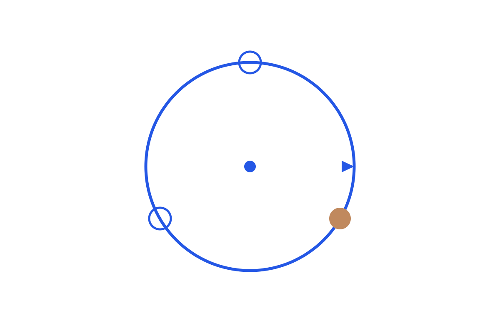

```{=html}

```

The series replaces the "Agent" definition question with an autonomy spectrum, then opens up what frameworks actually do underneath: the model emits, the API parses, your code dispatches and loops. The point is to know what kind of agent you have, and how it actually works.

Read in order:
